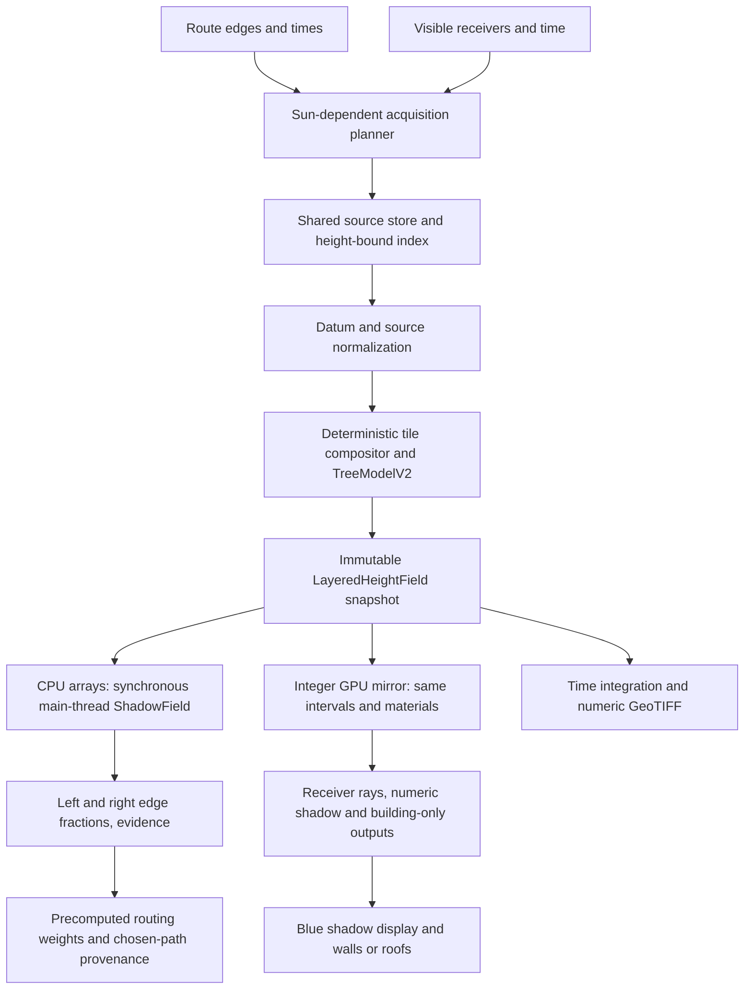

# Phase 2 — Shared layered shadow field

Design date: **2026-09-12**. Settled inputs: [BRIEF.md](./BRIEF.md),
[Phase 0](./00-findings.md), and [Phase 1](./01-current-engine-audit.md).
Scope: architecture only. This document specifies future behavior; it does not report an
implemented engine, authorize deployment, or create the later-phase documents or issues.

**Decision: one immutable, tiled `LayeredHeightField` serves both consumers.** Its CPU
typed arrays are authoritative. `ShadowField.sampleEdges` marches those arrays
synchronously on the main thread. The renderer marches an integer-texture copy of the
same tile generation. Terrain, buildings, and canopy are composed before either consumer
sees them. Camera matrices select and project receivers; they do not define caster data,
tree anatomy, height precision, or routing answers.

The representation retains **ground, opaque building top, crown base, and crown top**,
plus canopy material and evidence. A scalar `max(terrain, roof, canopy)` DSM is
insufficient. Phase 0's base/surface finding is carried forward and extended: two heights
are necessary but insufficient for simultaneous terrain, an opaque structure, and an
elevated transmissive crown in one column. This is an original design, not ShadeMap's
channel layout or its ambiguous reference-height semantics.

Unless labelled otherwise, specifications below are **[DESIGN]** decisions, not findings
about ShadeMap or measured physical truth. **[DERIVED]** numbers are arithmetic from
stated inputs; **[PRIOR]** numbers are model assumptions; **[UNMEASURED]** identifies
unverified performance or accuracy. The evidence standard in
[evidence.md](../notes/evidence.md) applies. No new runtime benchmark ran in Phase 2.

## 1. Contracts that determine the architecture

| Constraint | Binding design consequence |
|---|---|
| Synchronous, main-thread, camera-independent `sampleEdges` | Data preparation may be asynchronous; sampling may not fetch, await a worker, block on shared-memory synchronization, read GPU pixels, move the camera, or require a map instance. CPU arrays remain resident for a pinned query snapshot. |
| One tree model for rendering and routing | `TreeModelV2` owns crown-base inference, omission of trunks, seasonal transmission, and overlap policy. Both kernels use the same composed intervals and material table. Activation and rollback switch both consumers together. |
| Sun-dependent caster acquisition for buildings **and** canopy | Both subscribe through one acquisition planner, using receiver geometry and time. Decreasing altitude expands their required domains, including sources outside loaded map tiles. A march limit does not constitute acquisition. |
| Agreement harness and committed ceilings survive | Keep the existing corpus, reference, metrics, reporting, blue-pixel checks, and ceilings. Add the v2 implementation as a candidate; do not leave only the old implementation under the gate. Add actual CPU/GPU comparisons separately. |

Phase 1 also preserves two independent sidewalks, source/confidence semantics, chosen-path
provenance, data reuse and cancellation, building mesh/caster consistency, dedicated
building-mask isolation, camera-free spot queries, and exposure controls/export. Its
corrections stand: PR #313 discarded canopy contours; an elevated crown's projected near
edge can move without moving the tree; local `setSunExposure` currently does no accumulation.

## 2. Query contract before rendering

Keep the public methods and their return shapes in
[`ShadowField.ts`](../../app/lib/shadowField/ShadowField.ts):

```ts
interface ShadowField {
  shadowAt(lng: number, lat: number, when: Date): ShadowSample;
  sampleEdges(edges: EdgeRef[], when: Date): EdgeShadow[];
  sweep(edges: EdgeRef[], times: Date[]): EdgeShadow[][];
  ready(bbox: BBox, options?: ShadowReadyOptions): Promise<void>;
  readyEdges(edges: EdgeRef[], options?: ShadowReadyOptions): Promise<void>;
  coverage(bbox: BBox, when: Date): Coverage;
  coverageEdges(edges: EdgeRef[], when: Date): Coverage;
}
```

Extend `ShadowReadyOptions` additively with `times?: readonly Date[]`. The route caller
passes its frozen calculation time to both readiness calls; sweeps pass all requested
times. The existing `signal` and **one absolute `deadlineAt`** remain. Without `times`,
readiness loads receiver tiles only; it must not claim complete sunward coverage for an
unspecified date. `coverage*` always checks the actual requested time, even after readiness
resolves. A deadline can produce a usable partial snapshot, not proof of completeness.

The existing normal route allowance is **2500 ms total**, not per source or per tile
([Phase 1 §3](./01-current-engine-audit.md#3-shadowfield-as-routing-actually-calls-it)).
Keep that allowance; no new synchronous latency SLO is invented here.

The synchronous path is:

1. Freeze the published field generation and model version at method entry. Prepare or
   reuse the edge locations on the main thread; preparation of large data tiles happened
   before publication. Cache deterministic solar inputs by geographic cell and exact time.
2. Preserve input order, canonical edge direction, ±4 m sidewalk offsets, and
   `N = max(3, ceil(lengthM / 25))`, with `N+1` inclusive locations on **each** sidewalk.
   Average point transmission loss into `left` and `right`. The point-query five-location
   neighborhood remains exclusive to `shadowAt`; it is not multiplied into edge sampling.
3. March local arrays and their hierarchy. Return the whole `EdgeShadow[]` immediately.
   A cache miss is an explicit incomplete answer, never a synchronous network operation.
4. The existing caller populates its edge cache and sidewalk graph before Pareto/search
   work. Search continues to read precomputed weights, not perform per-relaxation marches.

`sweep` freezes one snapshot and edge layout for all times. It remains synchronous; a UI
may schedule separate batches between turns, but may not secretly change this method into
a promise. A time outside the prepared coverage gets incomplete evidence synchronously.
Workers may warm caches; correctness cannot depend on a worker replying during a query.

Keep existing night semantics, `shadow: 1, source: "none", confidence: 1`, under the
versioned solar definition in §8. Daytime missing data is distinct. For incomplete daytime
coverage, return a provisional estimate from usable resident inputs, with completeness
explicitly false and confidence below the existing fallback threshold; fully unsupported
points retain `shadow: 0, source: "none", confidence: 0`. Missing data must not acquire
positive confidence merely because a loop or readiness deadline ended.

Resident shade is a mathematical lower bound only when missing inputs can add occlusion
to an otherwise fixed recipe. Replacing an OSM fallback by a later CHM observation can
remove a crown, so provisional answers are not universally monotonic lower bounds. If the
receiver terrain/datum is unknown, the combined query cannot establish its ray origin;
return unsupported evidence instead of silently assuming sea level. A separately labelled
flat-ground building fallback remains possible through the existing fallback boundary.

Add optional evidence to samples/edges for `generation`, `modelVersion`, component
coverage, and incomplete reasons. Add `"terrain"` to `ShadowSource` and update exhaustive
source handling together; terrain must not be labelled building geometry or canopy.
Retain `buildingSource` and `canopySources`, and the distance-weighted chosen-path
aggregation in [`shadowProvenance.ts`](../../app/lib/shadowProvenance.ts). Confidence
remains a labelled prior, not a probability calibrated by this design.

Component coverage means completeness of the declared source recipe, not a complete census
of real objects. Return `terrain`, a building provider, or `canopy` for a sole usable
component and `mixed` for combinations. Known-empty but successfully evaluated source
coverage is evidence too; a sunlit result is not automatically `none`. Edge confidence is
the minimum over its required sidewalk evaluations, so one missing caster corridor cannot
be averaged into apparent completeness. Preserve richer per-component evidence for the
chosen-path explanation, including deliberately omitted trunks.

The existing explicit per-edge building-canvas fallback stays outside `ShadowField`.
It may report only its building evidence, as `canvas`; it cannot certify missing terrain
or canopy or replace a combined fraction with an apparently complete building-only result.
No new camera operation is introduced into sampling or spot queries.

## 3. The single shared data structure

### 3.1 Canonical tiles and snapshots

`LayeredHeightField` is a sparse map of immutable georeferenced tiles with a shared
conservative height hierarchy. It is one logical structure with multiple bands, not one
GPU texture and a separate routing geometry model. Proposed schema, shown as specification:

```ts
interface LayeredHeightTile {
  key: TileKey;                         // global grid + tile coordinates
  revision: string;                     // inputs, grid, datum, compositor, tree model
  groundQ: Int32Array;                  // G: bare-earth terrain
  buildingTopQ: Int32Array;             // B: absolute opaque roof, presence in flags
  crownBaseQ: Int32Array;               // C0: absolute underside
  crownTopQ: Int32Array;                // C1: absolute canopy top
  flagsAndMaterial: Uint32Array;        // separate presence, known/nodata, material ID
  provenanceIndex: Uint32Array;         // per-cell recipe in tile metadata table
  metadata: TileEvidence;              // bounds, datum, source support, acquisition dates
}
interface LayeredHeightField {
  generation: string;
  modelVersion: string;
  tiles: ReadonlyMap<TileKey, LayeredHeightTile>;
  boundsIndex: HeightBoundsIndex;       // per-component upper bounds and completeness
  materials: ReadonlyArray<CanopyMaterial>;
}
```

Heights are absolute **metres in one vertical datum**, encoded as `Q = round(64 * metres)`.
Zero is a valid elevation, not absence. Each component has distinct states for present,
known absent, nodata, and not acquired. Per-cell provenance distinguishes measured heights,
defaults, resampling support, source omissions, and inferred crown bases. A tile aggregate
validity fraction alone cannot certify a ray that crosses a nodata strip.

The default analysis lattice uses 256-cell Web Mercator tiles at **z17**, independent of
camera zoom. **[DERIVED]** Ground spacing is about 1.194 m at the equator, 0.915 m at 40°,
and 0.597 m at 60°, using §6's formula. This is a selected discretization, not a claim
about source resolution. Retain source-pixel placement and occupied-cell masks when
resampling canopy; never reduce a block to one occupied rectangle. Source overviews must
not switch when the camera zooms. A future finer analysis grid is a field/model revision
shared by both consumers and must pass the same gates.

Terrain is a continuous piecewise planar surface through `groundQ` samples, with one fixed
diagonal per grid square. Object intervals are constant over their raster cells. Ground
samples sit on grid vertices; object samples describe cell interiors. Tile borders fetch
the same global neighbor samples into a one-cell gutter. The final logical row/column of
ground vertices comes from the neighbor, not extrapolation. Traversal splits at terrain
triangle boundaries as well as object-cell boundaries, so the ground test is against
planes rather than artificial vertical terrain steps.

Tiles without local objects may encode constant absent bands or references to normalized
terrain blocks compactly. Expansion produces the same canonical samples. A coarse
height maximum is an acceleration bound, never a substitute occupied leaf cell. Fine
building/canopy geometry is not replaced by max-pooled squares at distant ranges.

### 3.2 GPU mirror, lifetime, and cache identity

Upload the four height bands into `RGBA32I` integer textures, with integer metadata
textures and a material palette. Use `isampler2D`/integer fetches and explicit interpolation,
not normalized color decoding or automatic filtering. The heights are CPU-composited and
uploaded; the format does not require rendering heights into a float framebuffer.
Integer texture and fetch facilities are defined by the
[WebGL 2 specification](https://registry.khronos.org/webgl/specs/latest/2.0/).

The GPU atlas/page table is a mirror of a named snapshot. Publish tile sets atomically;
never expose terrain from one recipe with canopy from another. The renderer may draw
only a subset of pages for its receivers, but uses the same page values, hierarchy rules,
solar-cell mapping, and model revision as a query there. CPU results do not depend on
which pages happen to be uploaded. The rendered frame records its generation/time so an
agreement capture can wait for matching publication rather than compare stale frames.
That subset must include every relevant offscreen **caster** page for those receivers,
not just visible terrain. Until its uploads complete, the display is pending/incomplete;
it cannot claim to be the completed rendering of that snapshot.

Cache keys include source revisions, grid level, datum transform, resampling policy, and
tree model. Sun/date does not change height tiles. Seasonal material state and solar
inputs key shadow-result caches. Camera pose keys display projection only. Publish newer
snapshots between synchronous calls; never mutate arrays under a query. Route leases pin
their required pages. A pan cancels only the viewport's interest, preserving shared reads
and route leases. GPU context loss loses the mirror, not the CPU field or routing.

**[DERIVED] Memory arithmetic:** four 32-bit height bands plus two 32-bit metadata bands
cost 24 bytes/cell: 1.5 MiB per 256² logical tile, 96 MiB for 2048² cells, or 192 MiB
for CPU and GPU copies of that dense area. This excludes gutters, source caches, hierarchy,
palette/metadata tables, page tables, double buffering, receivers, and driver overhead.
It is not measured peak memory. Bounded page residency, sparse absent bands, and route
priority are required. Admission must report incomplete coverage when a working set does
not fit; eviction must not silently replace data by zero. Device budgets and compressed
sizes are **[UNMEASURED]** and belong to later validation.

### 3.3 Why four heights, and the supported geometry limit

For a ground receiver below a tree, `G` locates the receiver, `[C0,C1]` is transmissive,
and `(G,C0)` is open air. A building in the same column adds an opaque interval up to `B`.
Taking `max(B,C1)` loses the difference between masonry, foliage, and air. Keeping only
`G` and that maximum still fills the underside; keeping only `C0,C1` loses terrain and
the building. A material flag cannot reconstruct the missing vertical boundaries.

The field represents terrain, ground-solid buildings with flat roof patches, and one
canopy interval per cell. It does **not** represent bridges/arcades, multiple disconnected
crowns stacked vertically, tunnels, or overhanging terrain. Such inputs need a future
multi-interval column format. Flag the limitation; do not disguise it by extending solids
downwards and calling the result accurate. Building holes/courtyards remain genuine holes
in the footprint mask. Vector polygons remain inputs and display meshes, not a second
shadow-answer representation.

## 4. Composition and the tree model

### 4.1 Datum, source normalization, and resolution reconciliation

Use an explicit orthometric reference, **EGM96 metres**, as the canonical datum decision.
An adapter must declare its source datum and convert to it, including the appropriate
geoid transformation if the source supplies ellipsoidal height. Provider suitability and
transform availability remain Phase 3 checks; no undocumented DEM is presumed EGM96.
Unknown or incompatible datum is incomplete evidence, not an assumed zero offset. Store
transform identity and vertical uncertainty with the normalized tile.

DEM resampling provides `G`. Interpolate valid terrain support only; do not interpolate
across unfilled nodata. An approximately 30 m DEM resampled onto approximately 1 m cells
is still approximately 30 m evidence. Its smoothness does not create surveyed kerbs or
street elevations. Use overlap gutters from the same normalized source to avoid seams.

Building and CHM heights are **above ground**, not absolute elevations. Never apply a
geoid offset to a CHM height difference. For a CHM value `h`, first evaluate the normalized
ground at that location, then form `C1 = G + h`. For buildings, normalize an entire feature
before tile clipping: choose a stable foundation elevation `F` from valid terrain samples
on its full footprint boundary (median unless a surveyed base is supplied), and form a
flat roof `B = F + heightAGL`. Clip the solid at the terrain surface. If `B` falls below
terrain on part of the footprint, flag a conflicting input rather than inventing a new
building height. Foundation and roof must be identical on both sides of a tile boundary.

Choose a building source once per feature/covered region, with stable IDs and deduplication;
do not stack tile and Overpass versions of the same building. Preserve a provider's
normalized height/default and its provenance, including Phase 1's different fallback
heights, until Phase 3 supplies a reconciled policy. Resolve intersecting building parts
to the highest valid roof at each occupied cell, with stable source/feature-ID tie breaks;
retain the winning recipe in provenance. Renderer meshes and `B` use those same normalized
roof heights. Respect polygon exteriors and holes during rasterization.

Rasterize objects using cell-center membership with a fixed boundary tie rule; preserve
the finest selected source occupancy, with nearest-neighbor CHM height sampling over
valid support. No height interpolation across crown edges, holes, or nodata. If source
cells are finer than the selected analysis lattice, detail below that lattice can be
lost; record both resolutions rather than claiming lossless contours. Boundary error is
a horizontal grid/source error and must be measured; height precision cannot remove it.
No stochastic block/instance dithering enters physical shade or routing.

### 4.2 `TreeModelV2`: decided once

| Item | Decision for v2 |
|---|---|
| Crown top | CHM above-ground height plus `G`; tagged OSM crown geometry supplies fallback where raster evidence is unavailable. Keep the source contour; do not infer rectangular crowns from block occupancy. |
| Crown base | Use a valid supplied crown-base measurement when present. Otherwise retain `C0 = G + 0.35 * h` as an explicit **[PRIOR]**. The height raster does not measure the underside. Reject invalid measured intervals with a data-quality flag. |
| Trunk | **Omit trunks in v2 for all tree sources.** CHM does not locate stems or provide diameters; a crown-shaped solid reaching the ground would invent a large trunk. OSM points alone do not solve the shared raster's subcell stem geometry. Record `trunkModel: "omitted"`. Adding real stem geometry is deferred to a joint model revision, not a render-only line. |
| Transmission | Retain **[PRIOR]** direct-beam transmission `tau = 0.10` leaf-on and `0.70` leaf-off from the existing canopy model. Material palette values are Float32; both consumers use those same values. They are not measured per-tree optical properties. |
| Multiple canopy hits | `Tcanopy = min(tau_i)` across intersected crown intervals; an unhit ray has `Tcanopy = 1`. Do not multiply transmission once per raster step or duplicate source. This retains the existing strongest-canopy convention and is independent of ray step length. It under-models multiple distinct crowns and foliage path length; that limitation is explicit. |
| Season | One UTC-date function for both consumers. Explicit evergreen/deciduous tags take precedence. Preserve the current tropical/hemisphere calendar fallback as a coarse **[PRIOR]**, with the same boundary behavior as `inLeaf`/`crownOpacity`; no renderer-only alpha calendar. Acquisition date and query leaf state remain separate evidence. |
| OSM/raster overlap | Valid positive raster canopy wins the cell; OSM fills raster-unavailable/nodata cells. A valid raster zero is known absent for that source epoch and is not automatically filled by an OSM crown. Record an OSM/raster conflict for later reconciliation. Among overlapping fallback crowns select the highest-top interval, then stable feature ID for ties; do not manufacture one interval spanning disconnected crowns. |

Changing transmission to an extinction-density integration needs calibrated density or a
declared new prior, source deduplication, and new optical validation. It is deferred; a
Beer–Lambert formula alone does not supply those missing inputs. Query-time seasonality
cannot restore tree extent absent from leaf-off imagery.

The empty space below `C0` is intentional. A 20 m inferred crown has a 7 m base; on flat
ground its near projected edge is at `7 / tan(altitude)`, matching Phase 1's 7 m at 45°
and approximately 19.23 m at 20°. These are **[DERIVED]** consequences of the retained
prior. The source footprint remains fixed. V2 must not promise a ground-connected shadow
at every tree or “fix” this displacement by filling air with foliage. It fixes the
discarded silhouette and makes the anatomy assumption explicit and consistent.

### 4.3 Building/canopy overlap and the column result

For a cell outside a building, retain the selected canopy interval unchanged. Inside a
building, masonry occupies ground through `B` and wins at every overlapping height:

```text
if C1 <= B: canopy absent in the composed column
if C0 < B < C1: canopy interval becomes [B, C1]
if B <= C0: keep [C0, C1], including the air gap above the roof
```

Do not subtract the entire building footprint from all canopy heights: an overhanging
crown above a lower roof can shade that roof. An implausible CHM/roof collision is recorded
as a source conflict. Geometry decides occupancy; provenance records that the data may be
wrong. The same rule is applied by the compositor before upload and routing publication.

For each ray, terrain or building intersection gives opaque transmission zero. Otherwise
transmission is `Tcanopy`; total shadow is `1 - transmission`. Buildings are opaque and
canopy is fractional, without adding two shadow percentages beyond one. Keep independent
building-hit evidence while marching so a building-only output does not include terrain
or canopy. No physical meaning is assigned to the basemap tint or decorative tree fill.

## 5. Height encoding and numerical precision

**Required v2 encoding: signed 32-bit fixed point at 1/64 m (15.625 mm) per count for all
four heights.** CPU composition calculates in Float64, quantizes once, then uploads the
same integers. GPU calculations use high precision and receiver-local coordinates/heights;
subtract the integer reference before conversion to float. CPU conformance calculations
use the same float-rounded solar inputs and explicit tie rules. Floating arithmetic is
not assumed bit-identical across JS and GLSL; boundary and fractional comparisons are gated.

The precision requirement comes from low sun, not the number of colors available in a
texture. On flat ground, shadow reach is `L = (Hcaster - Hreceiver) / tan(alpha)`. If each
height is rounded to the nearest quantum `q`, their difference can err by at most `q`:

```text
|deltaL_encoding| <= q / tan(alpha)
q <= epsilonL * tan(alphaMin)
```

Select an **encoding-only design budget** of 1 m at a 1° solar altitude. It requires
`q <= 0.017455 m`; 1/64 m satisfies it. These are not physical accuracy promises or
agreement ceilings. Below 1° the bound grows; the engine exposes that reduced precision
and acquisition uncertainty rather than clamping the sun to 1°.

| Altitude | Worst differential-height contribution, q = 1/64 m |
|---|---:|
| 1° | 0.8952 m |
| 5° | 0.1786 m |
| 10° | 0.0886 m |
| 45° | 0.0156 m |

**[DERIVED]** Table method: evaluate `(1/64) / tan(alpha * pi/180)` for the four specified
angles; no scene, hardware, or timing sample is involved. The bound excludes terrain
intersection conditioning, raster placement, receiver bias, solar error, source vertical
error, and incorrect tree anatomy. A source CHM quantized to whole metres remains whole-
metre evidence after conversion. A coarse DEM remains the dominant uncertainty in many
locations; encoding must not add avoidable metre-scale errors on top.

The schema rejects nonfinite/out-of-range elevations rather than saturating; use a declared
supported range of ±100,000 m, comfortably within the integer format and float conversion
of the quantized terrestrial heights. Negative ground elevations are supported. No tile
uses a height scale based on its tallest object; adjacent tiles decode identically.

Rejected encodings:

- **One byte per absolute height:** inadequate range and precision. Even 1 m steps give
  up to 57.29 m of differential-height displacement at 1° by the same formula.
- **Two bytes with one fixed world offset:** at 1/64 m only 1024 m of elevation span is
  available. Per-tile offsets can compress transport, but must decode exactly to the
  canonical Int32 values and handle overflow; they are not the authoritative format.
- **Half-float absolute elevations:** spacing grows with altitude (1 m in the binary
  interval [1024,2048) m, 2 m in [2048,4096) m), failing the encoding budget in hills.
- **RGBA8 copied from Phase 0:** channel count does not establish sufficient precision,
  and two encoded heights do not store this design's four independent boundaries.
  Float32 storage could meet the budget, but integer quanta make transport, caching,
  comparisons, and CPU/GPU height identity explicit without float-render-target support.

## 6. Coordinates, traversal, and seams

Use east/north/up in metres for solar geometry. Convert SunCalc's azimuth convention once
in the shared solar module; the marcher uses azimuth clockwise from true north. For a
local horizontal ground distance `s`, the flat local ray is:

```text
east(s)  = east0  + s * sin(azimuth)
north(s) = north0 + s * cos(azimuth)
z(s)     = z0     + s * tan(apparentAltitude)
```

Web Mercator is an index/projection, not a uniform ground metric. With the Web Mercator
radius `R = 6,378,137 m`, tile size `P`, and zoom `z`,

```text
ground metres per texel(phi) = 2*pi*R*cos(phi) / (P * 2^z)
ground distance = projected Mercator distance * cos(phi)   // local differential
projected increment for ground ds = ds / cos(phi)
```

At 60° a projected metre is half a ground metre. Apply the scale in horizontal traversal,
caster reach, sidewalk offsets, and building mesh altitude projection. Do not also scale
physical elevation or `tan(alpha)` a second time. Use Float64 geographic/world coordinates
for indexing and tile-local offsets on the GPU to avoid losing street-scale detail in
large global coordinates. Wrap longitude at the antimeridian; clamp unsupported polar
regions to the map's declared coverage, marking them unavailable rather than wrapping y.

For local tiles, update scale at segment midpoints instead of using the camera center for
an entire route. For long rays, advance the geographic sunward path across tiles, recompute
local orientation/scale, and express tile heights in the receiver's tangent frame. Include
Earth curvature in that transformation: convert orthometric heights through the declared
geoid model to ellipsoidal Earth-centered coordinates, then to the receiver's east/north/up
frame. Its small-distance vertical term is
`-s²/(2R)` for a same-datum remote surface relative to the tangent plane. **[DERIVED]** At
15 km and `R = 6,371,000 m`, this is about 17.66 m, so a flat plane is not an adequate
unqualified distant-ridge model. This geometric correction does not model atmospheric
ray bending through a varying atmosphere; that residual is recorded near the horizon.

Each kernel must implement the following common traversal specification:

1. Obtain the receiver's terrain elevation, or the actual wall/roof fragment height.
   Public route samples stay at ground surface, as in the agreement corpus; a 1.5 m
   pedestrian-body receptor would change the product and is deferred. Start with an
   explicit numerical lift of one height quantum, applied by both kernels and budgeted
   separately from §5's encoding error. Do not lift to `max(B,C1)` beneath trees.
2. Traverse every intersected leaf cell with a grid DDA, including diagonal/corner tie
   handling; a fixed-distance step that skips a one-cell crown is rejected. Inside each
   cell, test the ray-height interval against `[C0,C1]` and the opaque building interval,
   and solve intersections with its terrain triangles. Handle vertical sun with a
   vertical interval test; do not divide by a zero horizontal component.
3. Maintain `Tcanopy`, terrain-hit and building-hit state. Opaque hits can terminate a
   combined query, but a simultaneous building-only output must continue until the
   building result is settled. A canopy hit cannot terminate before a later opaque hit.
4. Skip hierarchy nodes only when their conservative component upper bounds lie strictly
   below the minimum ray height over the node's path segment and all relevant coverage is
   known, or when the component is certified absent. Bounds include quantization error and
   coordinate-transform error. Otherwise descend. A max-height node cannot itself prove
   a hit: it contains neither the obstruction's location nor a crown underside.
5. Exit as clear only when the acquisition/height bound proves no further relevant caster.
   Crossing a missing page, incomplete node, supported-distance boundary, or watchdog
   limit yields incomplete evidence. Neither CPU nor shader may label loop exhaustion sun.

Terrain continuity, object-cell ownership, gutters, DDA ties, and datum transforms are
part of the schema version. Use half-open object cells `[x,x+1) × [y,y+1)` in global grid
coordinates and advance both axes on an exact corner crossing. Test positive-length
interval overlap; an isolated tangency does not attenuate a ray. Rasterization uses the
same top/left boundary convention. Fix the terrain diagonal from the northwestern to the
southeastern grid vertex everywhere. These choices are independent of traversal direction.
A small receiver bias prevents self-intersection; it does not
excuse skipping the whole source building, which would miss another roof/part of that
feature. Sloped terrain and wall grazing cases require explicit bias fixtures. The full
numerical shadow-edge error is **[UNMEASURED]**, beyond §5's limited encoding bound.

## 7. Sun-dependent acquisition, including offscreen casters

### 7.1 Receiver domains and the reach rule

Routing receivers are the actual edge/sidewalk corridor, including endpoints, disconnected
graph components, and point-probe offsets. Visible receivers are the projected ground,
walls, and roofs in the camera frustum. These are separate subscribers to the same tile
store. Their caster sets may overlap; the viewport is never the routing acquisition domain.

For each subscriber and requested time, calculate separate terrain, building, and canopy
reach using **absolute obstruction elevation relative to the lowest receiver**:

```text
deltaH_j = max(0, certifiedUpperElevation_j - receiverLowerElevation)
D_j(alpha) = deltaH_j / tan(alphaLower) + spatialGuard
required_j = receivers swept sunward by [0, D_j]
```

`j` is terrain, building, or canopy. `alphaLower` is the lower altitude bound over the
receiver region and requested times, including declared angular uncertainty if available.
`spatialGuard` is at least a cell diagonal plus the source's declared horizontal error;
tile-edge clipping must also include complete footprints/CHM support crossing the boundary.
Use an all-direction buffer when angular uncertainty cannot justify a narrower wedge.
This planar formula is conservative for straight-ray curvature-corrected geometry; long-
range decisions also use the tangent-frame bounds in §6. A ridge's terrain elevation is
included in a tree/building top, not omitted in favor of height above ground alone.

**[DERIVED]** Examples on flat ground: a 400 m tower at 10° reaches 2268.51 m; a 20 m
canopy at 1° reaches 1145.80 m; a 1000 m elevation difference at 2° reaches 28.64 km.
These follow `deltaH/tan(alpha)` and demonstrate why the old 400 m march/padding cannot
become the new acquisition policy. Lowering altitude or changing azimuth invalidates
coverage and schedules additional **building and canopy** requests as well as terrain.
Height tiles already loaded remain reusable across time changes.

### 7.2 Obtaining bounds without assuming the answer

The maximum among already loaded casters cannot bound unseen casters. The acquisition
service needs a versioned spatial hierarchy containing terrain min/max, maximum **absolute**
building and canopy tops, known-empty flags, and coverage status. Each bound must cover
the whole underlying source tile, including features crossing its boundary. Bounds are
rounded outward. They come from source processing/metadata, not viewport observations.

The planner starts from coarse regional nodes covering the sunward domain, rejects only
nodes proved unable to intersect rays, and descends ambiguous nodes to request their
data. Source-specific bounds allow a distant ridge to be retained without downloading
irrelevant fine canopy everywhere. Native coarse DEM blocks may supply conservative
bounds, but do not certify absent buildings or trees. All three channels participate in
the coverage proof. A 15 km ridge fixture must be represented and cast when its bound
intersects; it cannot disappear because its tile is offscreen.

Where source upper-bound metadata is unavailable, progressively expand all applicable
source requests and mark the unproved remainder incomplete. Do not invent a universal
maximum building/tree height and claim full coverage. This fallback can improve the
answer but cannot establish completeness by reaching a quiet-looking outer ring.
Phase 3 must identify which sources can support the hierarchy; their absence does not
authorize skipping acquisition for a consumer.

Full-resolution loading is sparse and driven by the ambiguous sunward corridors, with
hierarchical empty-space skipping. A huge rectangular 1 m mosaic to a distant ridge is
not required. Route data has priority; viewport cancellation cannot abort a shared route
request. At a tile seam the traversal looks up the next georeferenced tile, not a clamped
edge texel. Gutters provide interpolation support, not a substitute for caster coverage.

### 7.3 Budgets, low sun, and incomplete evidence

At positive altitudes close to zero, finite acquisition may be too expensive. At
`alphaLower <= 0`, no finite planar halo certifies a clear ray. Use geographic/hierarchy
proof where possible; otherwise expose incomplete coverage. Never clamp altitude or reach
and return high-confidence sun. Deadlines and memory limits may stop preparation; they
do not change the physical model. Low sun can therefore produce provisional routes,
not a fabricated complete answer.

Require a deterministic traversal work limit shared by the two kernels as a watchdog,
with an incomplete result on exhaustion. Its numeric value is to be selected from the
later device/graph measurements, not disguised here as an established latency ceiling.
Cache and admission policies must keep synchronous work bounded in practice without
moving `sampleEdges` to a worker. **[UNMEASURED]** Worst-case main-thread march cost,
low-sun working sets, and the coverage achievable within 2500 ms remain release risks.

## 8. Solar position, horizon mapping, and penumbra verdicts

### 8.1 Solar model — retain SunCalc now; defer an SPA replacement

Use one shared synchronous `SolarModel` module for renderer and field, initially the
installed SunCalc **1.x** with a single explicit apparent-altitude correction. Retain
the direct dependency/import invariants. A worker can precompute the same values, but
the field computes them locally on a miss. Use geographic solar cells independent of
the viewport, preserving the current 2 km batching as the initial partition. Each
receiver maps to the same cell in both consumers. A distant ray uses the sun direction
at its receiver, transported into the traversed tile frames, not recomputed as if the
tile were a new observer.

Remove the renderer-only 0.15° dirty shortcut from authoritative time selection. Cache
by the selected UTC timestamp and cell, or reuse only with an explicit shared error
bound. UI animation may coalesce obsolete requests; a settled frame and a route at the
same timestamp must use the same sun. Spatial-cell angular approximation is part of
validation and acquisition margins, not evidence of SPA-level precision.

SPA's published angular uncertainty is ±0.0003°; that is the algorithm author's claim,
not a browser benchmark or a measured comparison with this app. The provided C software
also has redistribution restrictions, so it is not a drop-in MIT dependency. A future
replacement needs an independently derived or appropriately licensed implementation.
See the [official SPA algorithm and software page](https://midcdmz.nlr.gov/spa/).

**[DERIVED]** For a 20 m caster, the first-order sensitivity
`|deltaL| ~= 20 * csc(alpha)^2 * |deltaAlpha|` gives about 19.10 m at 1° if the angular
error is one arcminute, versus 0.344 m for 0.0003°. The brief's one-arcminute description
of SunCalc is **not a measured error bound for our implementation**. This calculation
justifies investigating SPA, not claiming that migrating will produce those improvements.
Retain SunCalc until the real date/location corpus establishes error and synchronous cost;
the architecture permits a joint solar-provider swap. Both costs are **[UNMEASURED]**.

Adopt atmospheric refraction as a shared, versioned approximation now: implement the
piecewise altitude correction published by
[NOAA's calculation details](https://gml.noaa.gov/grad/solcalc/calcdetails.html), using
geometric altitude as input. Apply it once. That model gives about 0.482° at geometric
0°; the brief's roughly 0.57° is not a universal constant to add at all altitudes.
NOAA itself describes atmospheric variability; no local pressure/humidity precision is
claimed. For geometric altitude below −1°, classify night without extrapolating the
correction into the deep night. Otherwise use the corrected point-sun center crossing
0° for night in both paths. Near-horizon results retain model uncertainty. A finite sun
disk and observer-dependent refractive ray curvature are deferred as below.

### 8.2 Horizon mapping — defer dense precomputation; retain as optional acceleration

Horizon mapping stores a maximum obstruction angle per receiver and azimuth.
[GRASS `r.horizon`](https://grass.osgeo.org/grass-stable/manuals/r.horizon.html) documents
directional horizon rasters, extra buffers, and maximum-distance controls. It is an
appropriate published technique to evaluate, not proof of its performance here.

**[DERIVED] Memory:** `receiverCount * azimuthBins * bytesPerAngle`. At 2048² receivers,
72 five-degree bins and two bytes/angle require **576 MiB** for one copy; 360 one-degree
bins require **2880 MiB**. Even 256² receivers at 72 bins require 9 MiB. These exclude
distance, confidence, additional vertical receivers, and GPU duplication. Coarser
azimuth bins can miss a narrow tower; interpolating two directional maxima is not a
conservative bound on what lies between them.

A single maximum angle works for opaque terrain/ground-solid obstacles at a fixed
receiver height. It cannot describe an elevated crown's open interval underneath, its
transmission, or new wall/roof receiver heights. A whole-scene horizon threshold would
silently undo the four-height decision. Consequently:

- **Defer dense whole-field horizon tiles as the default engine.** The initial authoritative
  path is the shared hierarchy plus interval march.
- Permit later coarse **terrain-only** horizons or sparse route-point opaque horizons as
  snapshot-derived accelerators, with azimuth error bounds and matching source coverage.
  Uncertain angles fall back to the march. They never replace the canonical field or
  require a GPU readback to answer routing.
- Annual exposure still requires time integration and canopy evaluation. “O(1) horizon
  comparison per sun position” does not make acquisition, precomputation, or a year's
  integration free. Break-even time and cache invalidation costs are **[UNMEASURED]**.

### 8.3 Penumbra — defer physical softness; preserve a path to joint adoption

V2 initially uses a point sun and fractional canopy transmission. Display antialiasing
smooths raster edges only and must not be described as physical penumbra. A future finite-
disk model should integrate transmission over the same deterministic angular samples in
CPU and GPU kernels. The roughly 0.53° solar diameter is illustrated in
[NASA's angular-size exercise](https://spacemath.gsfc.nasa.gov/transits/TRACEvenus.html).
**[DERIVED]** It suggests a spread of order `distance * tan(0.53°)` on a plane normal to
the central ray; projecting onto a ground plane at low sun expands that spread further.
This is a geometric estimate, not a measured scene result.

Reject a render-only widening of the acceptance band. It changes apparent coverage while
routing retains a hard edge, and a blurred threshold cannot correctly combine several
occluders or canopy transmission. Finite-disk support also expands the acquisition wedge
and changes dawn/night semantics; it must be a shared model version. Defer until the
basic field agrees and its synchronous cost is measured.

## 9. End-to-end execution and where composition runs



### 9.1 Adopt a hybrid preparation path

Adopt **offline/server normalization and regional summaries**, with **client worker
composition and a main-thread published result** for the initial delivery path. Static
COGs/tiles and a small versioned manifest/height-bound index can be distributed from object
storage/CDN. Do not require a request-time database or a long-running compute server just
to pan or scrub the sun. Existing direct COG reads and shared block caches remain a
fallback source path; they are not the renderer's authoritative camera-sized canopy frame.

The worker reprojects/resamples normalized source data, deduplicates buildings, rasterizes
footprints/crowns, applies overlap rules, quantizes, and builds bounds. It transfers a
completed buffer set to the main thread. Main-thread publication pins the CPU data and
schedules a GPU upload. No production dependency on cross-origin-isolated shared memory
or `Atomics.wait` is needed.

The same deterministic compositor may also produce **precomposed canonical tiles** offline
for repeated popular regions. Adopt that compatible cache path; defer precomputing complete
worldwide fused coverage until actual use and cost justify it. Such tiles contain all four
height bands and evidence, not only a top DSM. Their recipe hash must match local output;
server and client composition cannot apply different crown/overlap defaults.

| Placement alternative | Cost, latency, coverage, and cold-start assessment | Verdict |
|---|---|---|
| Raw inputs and all preparation in every browser | Avoids owned fusion storage, retains existing source coverage. Repeats decode/raster work and depends on remote request chains; cannot conjure trustworthy unseen-height bounds from a viewport. Cold canopy network cost was measured in Phase 1, not solved by faster shaders. | Retain as explicit incomplete-capable fallback, not the only target acquisition path. |
| Normalize inputs and summaries offline; compose in worker; cache hot fused tiles | Static serving avoids per-view compute cold starts and enables bounds-driven acquisition. Adds refresh/storage/egress obligations, but avoids eager worldwide fused storage. First uncached client composition still costs time. | **Adopt.** Regional/source availability stays explicit. |
| Precompute every worldwide fused tile | Minimizes repeat client composition where available, but replicates high-resolution data, multiplies storage by recipe/version, and makes updates expensive. Missing upstream coverage remains missing. | Defer pending measured demand and Phase 3 cost/licence decisions. |
| Generate DSM tiles in a serverless request for each view/time | Cold compute, source fan-out, request limits, and failure coupling enter the interactive path. Rebuilding static geometry per time is unnecessary. | Reject as the required path. |
| Server computes route shadows or time-specific masks | Adds network dependence to every new time or route and cannot implement the required synchronous local query on a miss. | Reject as the routing authority. |

GDAL/COGs are candidate offline tooling, not code to add in this phase. Monetary costs,
rate limits, provider licences/attribution, global availability, cold-start times, and
cache-hit rates are **[UNMEASURED / PHASE 3 INPUT]**. The architecture assumes versioned
static artifacts can be hosted; it does not authorize spending or imply they already exist.
Unavailable backend artifacts use the fallback with honest incomplete coverage.

### 9.2 Rendered pixel, building mask, and surfaces

`LocalShadowAdapter` becomes the consumer of a field snapshot and solar inputs. It maps
each visible receiver fragment into geographic location and elevation and evaluates the
same interval rules as routing. Terrain receives at `G`; roofs/walls use their actual
fragment positions. The custom roof/wall receiver mesh is generated from the **canonical
building occupancy and `B` boundaries**, with the normalized feature records supplying
height and provenance. Adjacent equal-height cells can share merged faces. Shading an
original vector wall against a cell that extends beyond it would put the receiver inside
its own caster; an arbitrary depth bias is not a fix for that representation mismatch.
The raster boundary can show steps at analysis resolution, an explicit geometric limit.
Any later subcell boundary refinement must enter the shared field and both evaluators.

Lift ground/roof receivers vertically by one height quantum. For walls use an outward
normal offset of that same distance in both evaluators, so a vertical lift cannot leave
the origin inside a vertical face; direction-facing tests still permit genuine shadow
from another part of the building. Depth and receiver-bias fixtures must verify this.
Canopy above a lower roof can cast on it. Do not retain the old projected-shadow-ceiling
texture as a second source of truth for wall shading.

The shadow pass writes numeric total transmission loss, dedicated building-only coverage,
and completeness. The combined result may stop at an opaque hit; building-only evaluation
continues independently if needed. Use separate channels/attachments from the evaluation
pass rather than copying a completed full-resolution building FBO on every draw.
`readBuildingShadowMask()` reads only the building channel with its existing byte/origin/
pixel-ratio contract. Readback is for explicit fallback, export, or verification, never
the ordinary `sampleEdges` path. Actual attachment formats and throughput require browser
validation; no speedup is asserted.

Composite numeric shade using the existing blue-dominant styling. Preserve
`isBlueDominantShadowPixel`, canopy-fill invariants, and `preserveDrawingBuffer: true`
while those compatibility consumers exist. A fractional canopy value is not recoverable
in general from a binary blue-pixel predicate; numeric CPU/GPU agreement uses the numeric
output, while the original opaque-building color agreement stays intact. Keep route and
canopy-extent layer ordering and full GL lifecycle cleanup.

### 9.3 Accumulation and export

Preserve `AccumulationPanel` controls and GeoTIFF export as product surfaces. Implementing
real accumulation is a new engine capability because Phase 1 established the local no-op.
The architecture provides a separate cancellable job that pins the field and integrates
numeric direct transmission at explicit times over a georeferenced receiver grid:

```text
equivalent direct-sun hours = sum(T_direct(point, time_i) * deltaHours_i)
```

Also retain elapsed daylight duration and data-complete duration so missing samples are
not counted as zero sun. With fractional canopy, this quantity is equivalent unattenuated
direct-sun hours, not literal hours with any sunlight or a diffuse-radiation estimate.
Use the same field, solar, and tree versions; readiness covers the union of all time
domains. Annual work may be chunked/offline; the synchronous routing contract does not
force an annual raster job into one main-thread call.

Export numeric Float32 GeoTIFF bands with CRS, geotransform, time range/integration method,
model/source revisions, units, and nodata/valid-duration information. A canvas RGB export
may remain a labelled visual export, but cannot be called numeric sun-hours. Completion
events fire only after the selected job completes or explicitly fails/cancels; stale work
must not overwrite a newer time range. Accuracy, convergence, throughput, and numeric
export round-trip are **[UNMEASURED]** until later validation.

## 10. Integration boundaries and gates on activation

This is a responsibility map, not Phase 4's ordered work-item plan. Proposed new paths
are architecture names; they do not exist as production code because of this document.

| Owner / proposed edit point | Responsibility |
|---|---|
| `app/lib/shadowField/ShadowField.ts` | Preserve synchronous API, edge layout, point neighborhood, sweep, evidence; replace geometry/canopy answer composition with the shared field evaluator. |
| `app/lib/shadowField/providers.ts`; `app/lib/canopyRaster/{canopyTileStore,sharedStore}.ts` | Source acquisition adapters, offscreen reads, leases, deadlines, cancellation, and reuse. No viewport-only provider may certify the new sunward coverage. |
| New `app/lib/shadowField/v2/{types,compose,treeModel,acquisition,bounds,march}.ts` | Canonical schema, single composition/tree contract, bounds planner, CPU interval traversal. Suggested signatures: `composeTile(inputs, recipe): LayeredHeightTile`, `planCoverage(receivers, times, index): AcquisitionPlan`, `traceTransmission(snapshot, receiver, sun): TraceResult`. |
| New `app/workers/shadowTiles.worker.ts` | Asynchronous data preparation only; publishes transferable immutable tile payloads. |
| New `app/lib/shadow/solarModel.ts`; existing `app/workers/sunPosition.worker.ts` | One versioned synchronous solar calculation, coordinate conventions and refraction; worker is optional cache warming. |
| `app/lib/shadow/{LocalShadowAdapter,IShadowLayer,createShadowLayer}.ts` | Snapshot consumer, GPU mirror and marcher, ground/roof/wall receivers, numeric outputs, dedicated mask, lifecycle and exposure job. |
| `app/hooks/useNavigation.ts`; `app/lib/{routing,shadowProvenance,shadowSampling}.ts` | Pass readiness times, retain batch-before-search and sidewalk costs, extend evidence/exhaustive source labels, retain explicit isolated fallback. |
| `app/lib/shadowField/{canopy,canopyRasterField,geometry,shadowIndex}.ts` | Retain input normalization and the frozen legacy reference as needed; retire parallel production canopy physics when v2 activates. PR-only `canopyRenderer.ts` must not remain a separate active model. |
| `app/components/{MapView,AccumulationPanel}.tsx`; `app/lib/canopyRaster/canopyLayer.ts` | Shared-store viewport subscription, stable extent display, rendering/export controls and readiness display. |
| `app/lib/shadowField/__tests__/agreement/`; `e2e/`; `scripts/verify/` | Preserved agreement gate, actual renderer checks, independent analytic/physical validation and scoped device measurements. |

### 10.1 Agreement ceilings are retained verbatim

The committed gate in
[`agreement.test.ts`](../../app/lib/shadowField/__tests__/agreement/agreement.test.ts)
continues to require:

| Metric | Existing committed requirement |
|---|---:|
| Cases | At least 100; retain the current 150-case corpus |
| Cities | Madrid, Singapore, Kent WA |
| Mean absolute sidewalk disagreement | ≤ 0.04 |
| p90 absolute sidewalk disagreement | ≤ 0.05 |
| Share with disagreement > 0.25 | ≤ 0.04 |
| Mean in each city | ≤ 0.08 |

Keep printed reports including worst reading, the nontrivial sun/shadow check, and both
canopy-fill color tests. Do not raise ceilings, drop difficult fixtures, move the
reference to the new marcher, or rebaseline reference pixels to make v2 pass. The original
building-only corpus feeds a flat-ground/no-canopy v2 snapshot and an explicitly supplied
fixture sun, so it tests the replacement field against the existing reference without
silently changing both geometry and solar truth. The existing legacy run remains as a
regression record. New production-solar cases test the shared solar change separately.

Add browser captures of **actual v2 numeric output versus v2 CPU queries** over matched
receivers, inputs, time, and generation. Apply the same aggregate ceilings to this added
corpus, with fractional transmission comparisons and individual fixture assertions; do
not pool it into the original corpus to dilute its tail. Keep the opaque blue-pixel
compatibility gate separately. Any representation/resolution choice that cannot pass the
existing gate must be corrected before activation. Agreement is necessary, not physical
accuracy: retain an independent analytic ray/plane/interval oracle and later real shadow
observations with their own error reports.

### 10.2 Required architecture witnesses

Later validation must demonstrate these behaviors; this list does not claim tests exist
or replace Phase 5's complete fixture/oracle/tolerance document:

- A crescent/holey CHM and Phase 1's two occupied-pixel positions remain distinguishable;
  date changes leave field coordinates unchanged. An elevated crown's projected near
  edge follows the base-height formula; it is not required to touch a nonexistent trunk.
- The identical `TreeModelV2` yields leaf-on/off fractional transmission in CPU and GPU,
  including source overlap and sampling under the crown. Subdividing an unchanged canopy
  interval into more ray steps does not increase opacity.
- Terrain plus relative CHM/building heights yields the same absolute roof/crown heights
  across datum-normalized tile seams. Courtyards remain open; above-roof canopy survives
  clipping and casts on roofs/walls. Roof self-shadow and grazing-slope cases exercise bias.
- The offscreen 400 m tower at 1000 m distance from Phase 1 casts at 10° without depending
  on MapLibre's loaded tiles. Repeat for offscreen canopy, then lower altitude and verify
  both acquisition sets expand. A distant ridge casts across many tiles. Missing bound
  metadata or a deadline produces incomplete evidence rather than an unqualified clear ray.
- An identical metric scene at 0°, 40°, and 60° has the expected ground-space shadow
  geometry. Negative elevations, high terrain, tile boundaries, antimeridian wrap,
  vertical sun, and long-range curvature expose encoding/coordinate mistakes.
- Routing returns a synchronous array on the main thread with no map/GPU access even
  after context loss. Pan/zoom/bearing/pitch cannot change a result for fixed snapshot,
  inputs, and time. A pan cannot cancel route acquisition; partial publication cannot mix
  generations. Preserve inclusive sidewalk counts and chosen-path provenance.
- Numeric exposure exports round-trip units/georeferencing and incomplete samples;
  visible RGB is not substituted for direct-sun hours.

Activation is one engine switch for rendering **and** routing, including tree/solar
versions and both canopy providers. An intermediate render-only tree change is rejected.
Rollback restores the complete previous engine pair; it does not leave new crown-base
or transmission rules in one path. Keep existing dependency pins and canvas invariants.

Profile the new engine on the same scoped Phase 1 fixtures and additionally on hardware
GPUs/mobile, pitched views, dense canopy, cold/warm sources, and actual route volumes.
Separate source waiting, composition, CPU sampling, upload, draw, mask output, and readback.
Record method, hardware, counts, and worst cases. Phase 1's SwiftShader copy bottleneck
motivates avoiding redundant full-frame copies; it does not prove ray marching is faster.
Failure to make synchronous routing and memory residency practical blocks activation;
moving sampling off-thread or relaxing agreement is not the permitted remedy.

## 11. Rejected alternatives and deferred extensions

| Alternative | Verdict and reason |
|---|---|
| Keep projected vector building shadows and fix only canopy drawing | Reject. Leaves two answer representations, no integrated terrain reception, and an easy path to repeating CPU/GPU tree-model divergence. Polygons remain acquisition inputs and display mesh sources. |
| Make every tree a ground-solid column to anchor its shadow | Reject. Invents foliage below the inferred crown, contradicts Phase 1's root-cause qualification, and overstates shade. Trunk omission is explicit rather than hidden by a false solid. |
| One scalar DSM, or just base/max-surface plus a material label | Reject. Cannot represent ground, a roof, an elevated crown underside, and distinct opacity simultaneously. Phase 0 demonstrated two heights; it did not prove two are sufficient for this composition. |
| GPU-only DSM plus readback for routing | Reject. Violates synchronous main-thread array queries and introduces a GPU dependency and transfer stall per batch/time. |
| Put `sampleEdges` in a worker or return a future | Reject under the Phase 1 contract. Workers prepare tiles and optional caches, not the required sampling call. |
| Renderer's viewport mosaic plus a separate route CHM/geometry model | Reject. Separate acquisition, clipping, tree assumptions, or resolution can disagree even when both use “raster” in their name. |
| Fixed 400 m halo, loaded-tile maxima, or clamped low-sun rays | Reject as complete coverage rules. They exclude valid distant casters; watchdogs must return incomplete evidence. |
| Maximum-height LOD cells drawn as occupied squares | Reject. Acceleration bounds do not preserve crowns or empty space; this repeats PR #313's contour loss. |
| All-caster BVH/triangle ray tracer or full voxel volume | Defer. Supports overhangs/multiple layers but increases memory, meshing, and GPU/CPU traversal complexity for predominantly DEM/CHM inputs. Reconsider when multi-interval geometry is a product requirement. |
| Beer–Lambert foliage volume, inferred stems, detailed phenology | Defer. Requires additional source evidence or explicit priors and joint validation. Current transmission/seasonality/trunk limitations remain visible. |
| Dense horizon atlas as the authoritative answer | Reject for full canopy semantics; defer bounded terrain/sparse opaque horizons as acceleration. Memory and angular/receiver-height limitations are explicit in §8. |
| Render-only penumbra or an immediate unmeasured SPA migration | Defer joint finite-disk modeling and SPA evaluation. Neither can bypass the shared model, synchronous cost, or unchanged agreement gates. |
| Import ShadeMap shader/compositor code or mirror its implementation structure | Reject. Phase 0 found the packages `UNLICENSED`; use independently derived interval/raster techniques. Understanding the published behavior grants no code licence. |

The remaining Phase 2 limitations are explicit: canopy underside and transmission remain
priors; trunks and stacked crown layers are omitted; source datums and regional bounds
need Phase 3 confirmation; source/receiver uncertainty can exceed encoding error; solar
accuracy and low-sun synchronous cost are unmeasured; infrastructure cost and achievable
coverage are unmeasured. They do not change the chosen structure or permit different
answers from the two consumers. Subsequent phases must resolve their release impact
without rewriting these hard contracts by implication.
