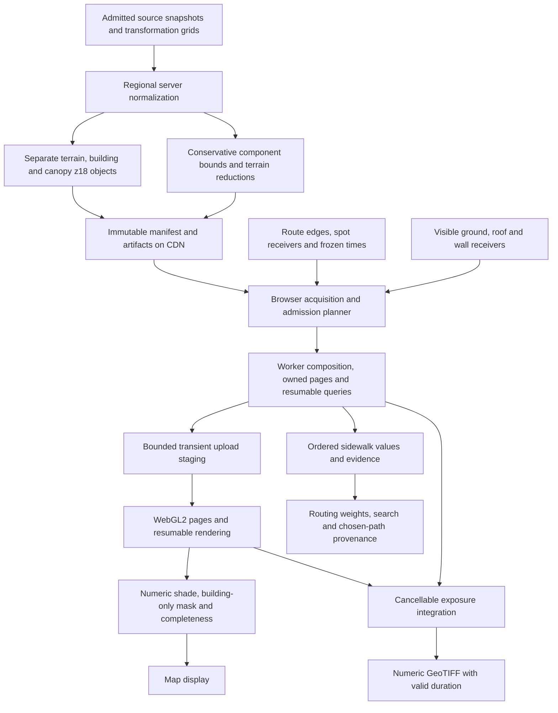

# Shadow engine v2 — current architecture

Architecture consolidated **2026-09-12**. This document supersedes
[02-architecture-superseded.md](./02-architecture-superseded.md), which preserves the
previous architecture verbatim. [BRIEF](./BRIEF.md), [00](./00-findings.md),
[01](./01-current-engine-audit.md), [02a](./02a-feasibility.md),
[02b](./02b-placement.md), [02c](./02c-lattice.md), [02d](./02d-delivery.md), and
[03](./03-data-sources.md) are the evidence record. References to the original 02
inside that record describe the archived design at the time of the investigation.
This 02 governs implementation; historical failures and undecided wording in those
records do not reopen the subsequent decisions.

**One immutable, layered field supplies worker queries and WebGL2 rendering.**
A regional server job normalizes sources, builds conservative bounds and terrain
reductions, and publishes canonical tiles through a CDN. The browser queries the
same versioned integers it renders. Its working set is sparse, bounded and streamed;
complete geographic coverage does not require simultaneous residency of every leaf.

Unless marked otherwise, statements here are **[DESIGN]**. **[PRIOR]** identifies
assumed model parameters; **[DERIVED]** identifies arithmetic, not measurements.
**[UNMEASURED]** marks qualification still required. Existing measurements remain
attributed to their original method, sample and hardware in the linked evidence.
No new benchmark, source research, application change or production activation is
part of this consolidation.

## 1. Decisions and coverage promise

| Decision | Current choice | Establishing evidence and consequence |
|---|---|---|
| Coverage model | **Global baseline with regional fidelity upgrades.** FABDEM v1.2 supplies baseline bare-earth terrain, replaced by admitted regional LiDAR where available; provenance records which applied. | Settled amendment replacing prepared-regions-only as the coverage model. Global describes the source baseline and preparation scope, not already published worldwide answers. Each region still needs normalized sources, component coverage and a normalizer-built conservative hierarchy before it can answer; unprepared support is unknown. Completeness certifies the pinned recipe, never a census of real obstacles. |
| FABDEM admission | **FABDEM v1.2 is admitted for Umbra's non-commercial personal use under CC BY-NC-SA 4.0.** | 03's exclusion assumed commercial/unrestricted reuse. That assumption does not apply to this project; NC does not bar the stated use. Attribution and share-alike remain terrain-data obligations. Commercial use would reverse this admission unless separately licensed; §5.1 records the condition and datum/spacing limits. |
| Building licence path | **Retain Overture/OSM under ODbL, with derivative-data publication.** Use pinned Overture building/building-part releases as the primary regional source and explicit OSM extracts where the recipe selects them; retain OSM canopy fallback. | Selected here from [03 §3.1](./03-data-sources.md#31-buildings) and [§7](./03-data-sources.md#7-licence-obligations-before-implementation). Source choice is deterministic per feature/region, with deduplication. Budget for data notices, reproducible modifications and derivative-database access. MIT continues to describe independent engine code. |
| Tile delivery | **Source-separated terrain, building and canopy objects with their own licences, composed in the worker** into the shared six-band logical field. | NC-SA must remain confined to the terrain object and its terrain-derived artifacts, without propagating to building/canopy objects or independent engine code. Bounds remain normalizer-built and source-separated. Costs are more requests and device-side composition/staging; [02d D1](./02d-delivery.md#d1--actual-z18-tile-compression) measured a fused body, so its ratios do not transfer unchanged. |
| Fine lattice | **Globally anchored z18, 256×256 logical cells**, independent of camera zoom. | [02c](./02c-lattice.md#every-ceiling-and-the-retained-tail) establishes z18 as the least costly tested agreement pass; [02d recommendation](./02d-delivery.md#production-recommendation-and-stopping-point) selects it for implementation qualification. z17 fails p90; z19 costs four times the cells for the same area. |
| Query placement | **Cancellable asynchronous browser-worker jobs.** WebGL2 renders locally. | [BRIEF amendment](./BRIEF.md) removes the synchronous/main-thread law; [02b §4](./02b-placement.md#4-stage-placements-lifetime-and-failure-behavior) establishes placement. Synchronous pure kernels may exist internally; the public query API is asynchronous. |
| Receiver validity | Occupied ground is invalid before bias or night handling; real roofs/walls keep their heights. | [02c receiver decision](./02c-lattice.md#receiver-decision-applied). Invalid values are null, with separate evidence on each sidewalk. |
| Distant terrain | **Conservative min/max reductions built during normalization**, refining ambiguous nodes to exact terrain leaves. | [03 §6](./03-data-sources.md#6-multi-resolution-exact-levels-and-what-they-mean). Provider mean overviews are not admissible caster substitutes. |
| Residency | A bounded phone profile with streamed exact refinement; full-set mirroring is not required. | The new budget and execution policy in §7 address [02d D2](./02d-delivery.md#d2--madrid-corridor-acquisition-and-working-set). **Coarse terrain alone does not prove that the measured 707 MiB case fits.** |

Global coverage means a baseline recipe can be prepared across the sources' valid
global support, with regional LiDAR improving fidelity rather than defining the
only supported regions. It does **not** mean every region is already prepared,
instant answers on a first visit, gap-free source observations, uniform survey
quality, or coverage beyond the lattice's polar limits. A never-prepared region
cannot answer until its normalized objects and bounds are published; it reports
pending/unavailable rather than treating a global source as a ready hierarchy.

A prepared region may offer a complete answer for some receivers/times and an
incomplete answer for others. Near its boundary, a sunward ray can require unknown
outside terrain, buildings or trees. Complete in-region tiles alone do not close
that proof. Incomplete source observations, default building heights, inferred tree
anatomy and source error remain visible even when all declared model data has been
evaluated. No reviewed free global stack supplies uniformly accurate street ground,
measured roofs and canopy optics ([03 §8](./03-data-sources.md#8-non-us-non-eu-coverage-and-the-free-tier-boundary)).

The engine is independently implemented. Phase 0 established layered raster
ray traversal, not permission to copy the `UNLICENSED` simulator code, shaders or
verbatim structure ([00 licence handoff](./00-findings.md#limits-and-licence-handoff)).

## 2. Data flow and stage placement



The placement table is the current form of
[02b §4](./02b-placement.md#4-stage-placements-lifetime-and-failure-behavior).
It retains the stage decisions and their evidence limits.

| Stage | Placement and trigger | Evidence determining placement | Failure/offline behavior |
|---|---|---|---|
| Source normalization | Persistent-container server job on source/recipe changes. Validate datums and masks, normalize complete features before clipping, construct the hierarchy and terrain reductions. | 02b found dependent source acquisition and repeated preparation unsuitable for the clock path. Full datum-correct regional production preparation remains unmeasured. | Published immutable generations remain usable with their age. New coverage stays pending/unavailable. An unknown datum is never assumed. |
| Tile composition | Browser worker on acquisition of matching normalized component objects; reuse composed pages across queries/times. The server publishes source-separated objects and bounds atomically under one manifest and evaluates the same recipe to build conservative bounds. | 02b establishes static reuse. Source separation is the settled delivery amendment; D1's fused-body compression evidence does not qualify separate-object delivery or worker composition cost. | A recipe mismatch is unavailable. Offline composition requires all needed component objects and matching bounds already cached. No raw-source or datum discovery is required on each query. |
| Shadow query | Dedicated browser Web Worker. One graph batch per calculation, selected-route/day jobs and spot jobs, with bounded chunks and exact-result caches. | 02b measured resident worker queries and UI heartbeat continuity under stress; its timings are not phone or complete terrain/canopy benchmarks. | Cached pages/bounds work without GPU or preparation host. Missing pages and exhausted budgets yield incomplete evidence; unsupported ground yields no combined value. Worker failure rehydrates from immutable artifacts. |
| Render | Browser WebGL2 in MapLibre's context, using a named field generation and shared solar/material inputs. | 02b's remote transport measurements exceed the clock cadence; 01's copy/fill findings motivate fewer full-frame copies. Full-screen v2 phone performance is unmeasured. | Context loss discards only the mirror. Worker queries survive; reupload on recovery. Pending caster refinement cannot be shown as a completed new-time frame. |

Retain 02b's concrete preparation candidate: one Fly `performance-1x`, 2 GB
Machine, one bounded active preparation process, durable R2 artifacts and a cached
custom-domain CDN. Stream normalization by tile/block; never expand a regional
mosaic merely because the job runs on a server. No deployment or spending is
performed here. The roughly $35.24/month scenario in
[02b §5](./02b-placement.md#5-cost-at-a-stated-usage-assumption) is dated planning
arithmetic, not an invoice or capacity guarantee. Its 40 reads/20 MiB per session
are not measured requirements; 02d replaced the per-query sizing assumptions.

Time never invalidates static geometry. A raw-source client path can only be an
explicit incomplete-capable recovery path; the normal client fetches canonical
artifacts or already normalized inputs. Request-time source normalization and
server-rendered frames are not required dependencies. Remote route/day batches
remain a deferred overflow capability, subject to the same versions/evidence and
separate deployment qualification, rather than a hidden fallback.

## 3. Query, receiver and publication contracts

### 3.1 Asynchronous jobs and actual events

The public service exposes asynchronous `shadowAt`, `sampleEdges`, `sweep`,
`ready`/`readyEdges` and coverage inspection. A day sweep may stream progress;
its final ordered result is awaitable. Specify requests/results with these fields:

```ts
interface QueryIdentity {
  requestId: string;
  generation: string;
  modelVersion: string;
  receiverVersion: string;
  solarVersion: string;
  materialVersion: string;
}
interface EdgeBatchRequest extends QueryIdentity {
  edges: readonly EdgeRef[];
  timesUtcMs: readonly number[];
  deadlineAt: number;
  signal?: AbortSignal; // facade sends explicit cancellation messages to worker
}
interface SideEvidence {
  shadow: number | null;
  validCount: number;
  totalCount: number;
  validSampleFraction: number;
  unresolvedCount: number; // receiver validity/ground could not be established
  source: ShadowSource;
  confidence: number;
  complete: boolean;
  incompleteReasons: readonly string[];
}
// sampleEdges(request): Promise<EdgeBatchResult>
// EdgeBatchResult echoes identity, times and input order, with left/right evidence.
// sweep(request): cancellable job with progress and Promise<EdgeBatchResult[]>.
```

Freeze the calculation time at submission, including graph readiness, sampling,
weights and route statistics; do not reread a mutable date ref during the job.
Resolve a generation before executing and pin its manifest/model identity for the
whole job. Individual leaf leases can change during streaming; their revision
cannot. Never mutate published arrays or mix revisions. The caller awaits one
completed or explicitly provisional batch before constructing sidewalk weights and
searching. Pareto/Dijkstra relaxations continue to use precomputed weights.

Preserve input order, canonical edge direction, ±4 m sidewalk offsets and
`N = max(3, ceil(lengthM / 25))`, with `N+1` inclusive locations on each sidewalk.
Only `shadowAt` uses the five-location neighborhood. The width-clamp experiments
in [02d D4](./02d-delivery.md#d4--kent-invalid-samples-and-street-width-clamp) do
not change the selected receiver layout.

| Event | Required work and publication |
|---|---|
| Same-day timeline drag/play | Update solar/render work, coalescing obsolete requests. **No automatic route-card resampling.** Retain calculation timestamp on stored route statistics. |
| Normal route/recalculation or sketch | One batch for every canonical graph edge before weights/search. Readiness shares one absolute **2500 ms** allowance across broad/exact acquisition and all sources. It is not an overall graph-fetch/search SLO. |
| Route selection, local-day or offset change | Rebuild the selected route's 15-hour series, 06:00–20:00. Coalesce obsolete day jobs; complete the settled request, not every playback tick. No mandatory 15 sequential WAN calls. |
| Spot/assistant query | Use the same worker field and receiver/evidence contract, independent of map pose; consolidate the separate current assistant query path during integration. |
| Pan, lower sun or new azimuth | Acquire missing receiver/caster pages and bounds; retained heights stay reusable. New coverage may remain pending beyond the clock cadence. |
| Accumulation/export | Separate explicit cancellable grid/time integration job (§9). |

These distinctions are established by [02b §1](./02b-placement.md#1-requirements-derived-from-the-caller)
and the [02c route-card trace](./02c-lattice.md#same-day-route-percentage-code-confirmation).
The 30 ms drag gate and 50 ms playback gate are event cadences, not measured v2
frame guarantees. The observed 908-edge/7,314-location graph is not a maximum:
02b's production padding produced **4,039 edges/32,612 locations** for the same
walk. Both belong in qualification, plus a workload distribution.

Cancellation is per subscriber and request. Pan cancellation cannot release a route's
active leases. Worker chunks yield so cancellation can be delivered. Only the latest
request for a subscriber may publish; an older calculation cannot overwrite newer
time/route results. An immutable old complete frame/result may remain visible with
its original timestamp while the replacement is pending.

### 3.2 Validity and evidence

Apply [02c's receiver contract](./02c-lattice.md#receiver-decision-applied)
identically in CPU and GPU:

1. Locate the receiver in its containing half-open canonical cell. A ground receiver
   inside its opaque building interval is invalid **before bias and before night**.
   It is neither sun nor shade. Its building remains a caster for other receivers.
2. Roof/wall receivers use actual surface heights, with the surface-specific bias;
   do not reject them under the ground rule or lift a route sample onto a roof.
3. Average each sidewalk over valid locations only. With scheduled set `S` and valid
   subset `V`, `validSampleFraction = |V|/|S|` and
   `shadow = sum(shadow_i, i in V)/|V|` when a supported value is available.
   Invalid points contribute to neither numerator nor denominator.
4. An empty-valid sidewalk returns `shadow:null`, `source:"none"`, `confidence:0`.
   Each side retains its own counts/fraction/evidence; edge confidence is the
   minimum of the two side confidences. An entirely invalid edge has both values
   null and zero confidence. The same no-value distinction applies to spot queries.
5. Valid night points retain `shadow:1`, `source:"none"`, `confidence:1`. Valid,
   evaluated daytime sun is numeric zero with usable source evidence. Invalid night
   points stay invalid. Unknown ground/occupancy is unresolved validity, never
   silently admitted as valid; report it separately from known invalid locations.

Production confidence is not a calibrated probability. 02c's daytime prior `0.8`
times valid fraction is a **probe convention**, not a new routing penalty. Preserve
valid-fraction attenuation and incomplete evidence, but qualification must establish
the production confidence policy. The field sets no minimum-validity threshold,
edge rejection rule or numeric substitute for null. Routing's missing/low-confidence
cost policy remains a blocking integration item (§12).

If receiver terrain/datum is unsupported, the combined ray has no justified origin:
return null/unsupported evidence, not sea-level shade. If its origin is valid but
sunward data is incomplete, return a labelled provisional estimate where possible,
with `complete:false` and insufficient confidence to imply full coverage. Source
replacement can remove as well as add canopy, so such estimates are not universally
monotonic lower bounds. A null must never become an ordinary zero in routing/export.

Component states distinguish present, known absent in the selected source, nodata,
not acquired, unadmitted datum, out-of-region, pending refinement, memory/work limit
and deadline. Add `terrain` to source handling; preserve `buildingSource`,
`canopySources`, `mixed`, per-component completeness and distance-weighted chosen-path
provenance. Known-empty evaluated source support is evidence. A building-only canvas
fallback remains explicitly `canvas` and cannot certify missing terrain/canopy or
replace a combined answer with apparently complete evidence.

## 4. Canonical field and tile container

### 4.1 Logical field

Retain the original four-height representation and interval semantics from
[archived 02 §§3–6](./02-architecture-superseded.md#3-the-single-shared-data-structure),
with the lattice and validity amendments established in 02c:

| Band, in planar order | Canonical type and meaning |
|---|---|
| `groundQ` (`G`) | Int32 bare-earth ground vertices, absolute EGM96 metres ×64 |
| `buildingTopQ` (`B`) | Int32 absolute opaque roof; presence independent of height |
| `crownBaseQ` (`C0`) | Int32 absolute crown underside |
| `crownTopQ` (`C1`) | Int32 absolute crown top |
| `flagsAndMaterial` | Uint32 presence, per-component known/nodata/inferred states and material-palette ID |
| `provenanceIndex` | Uint32 index into a versioned tile recipe/evidence table |

Zero and negative elevations are valid. Quantize once from Float64 with
`Q = round(64 * metres)`; reject nonfinite/out-of-range values rather than saturating.
The supported range is ±100,000 m. At 1/64 m, the encoding-only differential-height
reach error is at most `(1/64)/tan(alpha)`, approximately 0.8952 m at 1°; it excludes
source, lattice, solar, bias and intersection-conditioning error. No low-sun clamp
is implied ([archived 02 §5](./02-architecture-superseded.md#5-height-encoding-and-numerical-precision)).

The fine lattice is **z18**. Ground spacing is
`2*pi*6378137*cos(latitude)/(256*2^18)`: approximately 0.454650 m Madrid,
0.596998 m Singapore and 0.404353 m Kent. These are derived grid spacings, not
source survey accuracies ([02c memory derivation](./02c-lattice.md#memory-and-tile-sizes-re-derived)).
Ground is a continuous piecewise-planar surface with a fixed NW–SE diagonal.
Ground samples lie on vertices; objects occupy cell interiors. A one-cell border
uses true globally adjacent support, producing 258×258 stored samples per band;
the next tile supplies the final ground vertices, not extrapolation. Missing
neighbor support is marked unknown. Tile seams cannot clamp the marcher to an edge.

Rasterize object cell centres with fixed top/left boundary ownership. Preserve
nearest-neighbor CHM occupancy/masks on the selected **native** source level,
including holes and zeros. z18 resampling creates no new measured detail; it cannot
recover source placement error. Never turn block occupancy into a rectangle or
switch the analysis level with camera zoom. 02d's overview-1 canopy tiles were
compression witnesses, not the final native-canopy recipe
([03 §6.3](./03-data-sources.md#63-canopy-levels-are-available-but-do-not-change-the-crown-contract)).

### 4.2 Planar wire format and identity

Terrain, buildings and canopy are independent immutable delivery objects, each
with its own versioned header, component-band directory, compressed planar payload
and licence/evidence references. One generation manifest pins compatible object and
hierarchy hashes; the worker composes §4.1's six-band logical field for both consumers.
That field is an in-memory view, not a fused redistribution object.

Terrain owns `G` and terrain-derived support, including any terrain-sampled
complete-feature foundations. Building objects retain independently sourced roof/
height information, footprints and foundation references; canopy objects retain
native AGL heights, masks and model inputs. Do not bake FABDEM-derived absolute
`B/C0/C1` or terrain samples into building/canopy delivery objects. Apply ground
offsets, interval overlap and merged flags/provenance in the worker using the pinned
recipe. Keep component metadata and bounds under their respective source licences;
terrain-derived reductions/support remain part of the terrain object family.
Required header/directory fields:

- Magic and format version; tile key, z18 lattice/diagonal version, logical size,
  stored size and gutter width; little-endian byte order and 1/64 m quantization.
- Component kind and independent object identity/licence; generation,
  source/normalizer/compositor/tree/receiver versions, canonical datum
  and transformation recipe hashes; matching hierarchy generation and coverage.
- Band name/type/order, decoded offset and byte length, **predictor per band**;
  compressed payload offset/length, codec and codec parameters, and decoded-content
  checksum.
- Material/provenance table references and hashes; source support, dates,
  uncertainty, licence/attribution manifest and per-component validity metadata.

Use planar layout with **per-band horizontal delta** as the default predictor.
For each row of each band, retain the first 32-bit word and encode subsequent words
as `current - left modulo 2^32`; reset at every row and band, including stored
border rows. Decode by prefix addition modulo 2^32, then interpret signed/unsigned
words according to the band type. Predictor enum values are `none` and
`horizontal-delta-u32`; unknown values are rejected. A producer may select `none`
for a band when encoding its actual values is smaller; the decoder follows the
recorded value and never guesses from the codec or band name.

Use gzip with encoder level 6 over each object's concatenated transformed planes
in one compressed stream per object, with per-band decoded ranges in its directory.
Changing codec/predictor changes transport identity, not decoded physics. Checksums
verify the canonical integers after decompression and inverse prediction, including
borders. Final binary field widths/bit allocation and browser decoder qualification
are format-implementation blockers, not permission to omit the fields above.

The starting codec/predictor choice follows
[02d D1](./02d-delivery.md#layout-and-codec-controls): pooled planar-delta
gzip improved the matched interleaved baseline, but Kent's plain-planar gzip was
smaller than delta gzip and interleaved Brotli performed well there. **Delta is not
universally better.** Per-band adaptive selection and this production container
were not measured by that experiment. Do not assign them D1's ratios or decode times.
D1 measured a **fused six-band body**. Separate objects change compression context,
headers and request count, so its compression ratios and wire/decode estimates do
not transfer unchanged. More requests and device-side composition are explicit
costs; their production impact is unmeasured. D1's 50 tiles are two adjacent
25-tile regions with unvalidated AWS datums and non-native canopy; the body-size
evidence does not certify production delivery.

The composed six-band pages still cost 24 B/cell/copy: 1.5 MiB per logical tile,
1.523529 MiB including the border. Separate decoded inputs, component metadata and
composition scratch are additional allocations, charged explicitly in §7.
Upload height bands into integer `RGBA32I` textures, metadata into
integer textures, and material values into a shared Float32 palette. Use integer
fetch and explicit interpolation. Worker arrays are authoritative; main-thread
upload copies are temporary. Exact cache identities include all model/source/datum/
resampling versions; time/season key query results, camera pose keys display only.

## 5. Source admission, normalization and tree composition

### 5.1 Admission and licences

Use **EGM96 orthometric metres** as the common reference, admitted **per source**.
A source manifest must identify original horizontal/vertical CRS, realization,
epoch/tide convention where relevant, actual asset/release, transform pipeline,
grid hashes/licences, operation area, mask/quality meaning and validation residuals.
Convert identified inputs before blending/resampling across source boundaries.
Statistical source/transform accuracy, exact model bounds and numerical error are
separate quantities ([03 §4](./03-data-sources.md#4-datum-what-the-endpoint-actually-establishes)).

**AWS Terrarium is not certified production ground.** Its contributor headers do
not establish the delivered vertical datum or whether a transform was already
applied. Madrid EU-DEM and Kent NED have different published source references;
a tile-wide contributor list cannot reverse unknown mixed-source processing.
Neither blindly applying source transforms nor assuming EGM96 is valid. Prefer
identified direct ground assets. The discovered Madrid/Kent/Copernicus transform
paths in 03 were operation discovery with missing grids, not successful validated
transformations. Unknown CRS, unavailable grid or out-of-area transform blocks
that terrain's admission. AGL building/CHM height differences receive no geoid offset.

**FABDEM v1.2 is ADMITTED as the global modeled bare-earth baseline.** 03 excluded
it under an assumed commercial/unrestricted-use requirement; Umbra is a
non-commercial personal project, so CC BY-NC-SA 4.0's NC restriction does not bar
this use. This supersedes that exclusion, not the licence: retain attribution,
modification notices and share-alike for FABDEM-derived terrain. **If Umbra's use
becomes commercial, this admission reverses unless separate permission covering
that use is obtained; otherwise replace FABDEM before that use.** Independent MIT
code does not make the terrain unrestricted.

FABDEM inherits Copernicus GLO-30's elevation reference (EGM2008, subject to pinned
release metadata) and approximately 30 m source spacing. Validate its conversion
to EGM96 under the same source/transform rules above. Its z18 terrain is
**interpolated modeled ground, not surveyed z18 detail**; algorithmic removal of
buildings/forest does not establish local ground truth or hard error bounds.
Upgrade to admitted regional LiDAR DTM where available, including suitable USGS
3DEP and identified national/project ground. Pin the selection and boundary policy,
and record per-support provenance identifying FABDEM or the regional source that
actually supplied `G`, its release, native spacing and transformation.

SRTM/Copernicus/PGC surface products can be explicitly degraded elevation proxies,
but cannot silently qualify as bare-earth `G` or double-count trees/buildings
already in their surface. Missing source support or an unvalidated transformation
still yields unsupported combined coverage; admitting the FABDEM dataset does not
claim every regional build is ready. MapTiler display access does not authorize
canonical bulk extraction ([03 §§2–3, 8](./03-data-sources.md)).

For the selected ODbL path, keep source-separated preparation records and
reproducible feature modifications, and treat feature-derived heights, occupancy
and bounds conservatively as derivative databases. Publish the required derivative
database or qualifying alteration material and ODbL/OSM/Overture notices. Deliver
terrain, buildings and canopy as independent objects under their own licences,
with source-separated bounds and reproducible modifications. NC-SA must not
propagate beyond the terrain object family: retain terrain-derived values there
and compose the cross-component field only in worker memory (§4.2). Separate input
folders followed by fused publication would not satisfy this decision. Carry CHMv2
CC BY 4.0 creator, Vantor/source, licence and modification notices and each selected terrain/grid's
actual notices into artifacts/exports as required. The later dataset-specific
CHMv2 grant is the selected grant; model-weight licensing is separate.
The underlying notices and resolved CHMv2 conflict are recorded in
[03 §7](./03-data-sources.md#7-licence-obligations-before-implementation).

Direct Microsoft CDLA/Google CC BY remain unselected alternatives. Choosing them
for buildings would not remove the retained OSM-tree obligations. No app code
licence is changed by this data-publication decision.

### 5.2 Deterministic composition

Normalize whole building features before clipping. Choose a surveyed base when
available, otherwise the median of valid terrain samples around the complete
footprint boundary; form one stable foundation `F` and roof `B = F + heightAGL`.
Preparation retains terrain-sampled `F` in terrain-derived support keyed to the
complete feature/recipe; the worker joins it with independent building inputs.
The server evaluates this same recipe for bounds, without publishing fused leaves.
Retain the declared provider-specific height/default policy and provenance. Resolve
building parts, source priority, IDs and duplicates before rasterization; preserve
courtyard/relation holes. Higher valid overlapping roofs win, with stable feature-ID
tie breaks. A roof below terrain is a conflict, not an invitation to invent height.
Overture's height/min-height semantics require explicit normalization; ground-solid
v2 cannot accurately represent a raised arcade simply by extending it to ground
([03 §3.1](./03-data-sources.md#31-buildings), [§5.2](./03-data-sources.md#52-what-the-regional-normalizer-must-compute)).

`TreeModelV2` remains shared and versioned, from
[archived 02 §4](./02-architecture-superseded.md#4-composition-and-the-tree-model)
and [03 priors](./03-data-sources.md#33-vertical-grids-and-non-measured-parameters):

| Item | Shared rule |
|---|---|
| Crown top | Native mask-aware positive CHM `h`: `C1=G+h`, nearest-neighbor occupancy. |
| Crown base | Valid supplied measurement, otherwise **[PRIOR]** `C0=G+0.35h`; flag invalid intervals. |
| Trunks | Omitted for every source; record `trunkModel:"omitted"`. No ground-solid crown used to imply a stem. |
| Transmission | **[PRIOR]** `tau=0.10` leaf-on, `0.70` leaf-off; shared Float32 material values. Along the ray use `Tcanopy=min(tau_i)` over intersected crowns, initially 1. Do not multiply once per cell/step. |
| Season | Same UTC-date function and existing tropical/hemisphere calendar fallback in both consumers; explicit evergreen/deciduous tags take precedence. Acquisition date remains distinct. |
| OSM overlap | Raster valid positive wins; valid zero stays absent for that observation; OSM fills only raster-unavailable/nodata support. Record conflicts. Among fallback crowns choose highest top, stable ID on ties, rather than joining disconnected intervals. |
| Roof overlap | Masonry wins at overlapping heights. If `C1<=B`, canopy is absent; if `C0<B<C1`, clip to `[B,C1]`; if `B<=C0`, keep the crown including its air gap. Above-roof canopy can shade that roof. |

Terrain/building hits give transmission zero; otherwise total shade is
`1-Tcanopy`. Keep independent building-hit evidence for the building-only output.
The ground position stays fixed as time changes. An elevated crown's projected
near edge may move physically; for the 20 m/0.35 prior it begins at
`7/tan(altitude)` from its footprint. Fixing PR #313's discarded contour does not
require filling the air below the crown ([01 root causes](./01-current-engine-audit.md#1-root-causes)).

The format supports ground-solid buildings and one canopy interval per cell.
Bridges, tunnels, overhanging terrain and stacked disconnected crowns require a
future multi-interval revision. Strongest-canopy transmission under-models optical
path length/multiple crowns. Those are recorded limits, not hidden renderer variants.

## 6. Hierarchy, terrain levels and traversal

### 6.1 Normalizer-built bounds and geographic coverage

The **normalizer** creates the hierarchy while producing the canonical field;
no reviewed provider supplies this complete normalized component index
([03 §5](./03-data-sources.md#5-bounds-hierarchy-provider-capabilities-and-required-normalization)).
For each node retain spatial footprint, `minG/maxG`, maximum absolute `B/C1`,
separate component known/empty/unknown states, and source/recipe identity. Scan
all normalized support including terrain triangle vertices, gutters, complete
feature roofs and canopy masks. Reduce children with outward rounding, enclosing
quantization/interpolation and coordinate-transform error. Unknown children
propagate unknown for the affected component; known-empty has its own state.
Source RMSE/LE90 is not a hard outward-bound allowance.

The logical node joins source-separated bound records under the pinned manifest.
Keep terrain-dependent absolute envelopes in terrain-derived artifacts, referenced
alongside independent building/canopy bounds; do not embed FABDEM-derived values
in those independently licensed objects. This changes packaging, not the
normalizer's responsibility to build and validate the complete conservative proof.

Publish the index atomically with the generation. It can be fetched without its
fine objects, but the server must first have inspected the source support. Global
baseline availability does not bypass this preparation step. Building
attribute ceilings, U8 CHM limits, loaded-field maxima and GMTED extrema of a
different historical field cannot close missing coverage. Outside the built index
is **unknown**, including an unprocessed neighbor of a complete tile. A finite
regional model does not certify an empty exterior or all real-world objects.

Plan separate terrain/building/canopy acquisition for route sidewalk strips,
including endpoints, disconnected components and point offsets, and for visible
ground/roof/wall receivers. For an admitted bound in the local planar case:

```text
deltaH_j = max(0, upperAbsoluteElevation_j - receiverLowerElevation)
reach_j = deltaH_j / tan(alphaLower) + spatialGuard
required_j = receiver domain swept sunward by reach_j
```

Use the lower solar altitude over the region/times and declared uncertainty;
include at least a cell diagonal and declared horizontal uncertainty in the guard.
Unknown azimuth uncertainty cannot justify a narrow wedge: use an all-direction
buffer where needed. The long-range proof uses tangent-frame bounds. Lowering
sun or changing direction can require more of all three components. A bound only
from already acquired data cannot set the outer search limit.

Start at covering coarse nodes, reject components proved irrelevant, and descend
ambiguous nodes. A clear ray requires a proof covering its remaining domain;
an unknown exterior, missing page, exhausted deadline or work limit leaves it
incomplete. At `alphaLower<=0` a finite planar halo does not prove daylight
completeness. Never cap reach or clamp altitude to manufacture sun. These rules
carry forward the acquisition obligation from
[archived 02 §7](./02-architecture-superseded.md#7-sun-dependent-acquisition-including-offscreen-casters)
as corrected by [02b §4](./02b-placement.md#4-stage-placements-lifetime-and-failure-behavior)
and 03.

### 6.2 Multi-resolution terrain is conservative acceleration

During normalization, reduce the exact selected z18 terrain surface into levels
z17, z16, z15, z14 and progressively coarser parents as needed. Every coarse cell
stores **min/max of all supported fine terrain over its footprint**, coverage and
provenance. Include the boundary vertices/triangles; parent extrema enclose all
children. A cell with any unknown support cannot receive a clear-node certificate.
Alternatively encoded residuals must enclose the same exact surface; v2 selects
direct min/max for simplicity.

Use z18 for receiver elevation and exact leaf intersections. For distant terrain,
start at a coarse level such as z14 and refine adaptively. If the whole ray segment
is strictly above its conservative upper envelope, skip the node. Otherwise
descend; at a leaf solve the actual triangle intersection. A coarse maximum is
neither an opaque mountain nor proof of a hit. Record generation/support for every
skip so both kernels implement the same proof. Coarse results are not allowed to
replace fine receiver heights.

These levels are built from **the normalized selected field**, never fetched as
provider average overviews. AWS changes source families with zoom, Copernicus COGs
average, and native sample spacing/statistical accuracy does not certify reduced
extrema. GMTED min/max only bound their own admitted historical inputs. This is
exact model-to-model enclosure, separate from uncertain real terrain. The rule
comes from [03 §6](./03-data-sources.md#6-multi-resolution-exact-levels-and-what-they-mean).

Building/canopy bounds always participate. A terrain-only coarse node is usable
without fine objects only where those components are known absent or proved below
the ray. If either is ambiguous, request its **source-separated fine object** and
the terrain/recipe dependencies needed for exact worker composition. No coarse
square can stand in for a narrow building or crown. Independent component delivery
and terrain acceleration can avoid redundant distant inputs; any resulting
residency saving depends on the required components and composed-page allocation.

### 6.3 Shared numeric kernel

Use east/north/up physical metres, azimuth clockwise from true north, and the
shared apparent solar altitude. Locally,
`east=east0+s*sin(azimuth)`, `north=north0+s*cos(azimuth)`,
`height=height0+s*tan(altitude)`. Mercator projected distance converts to ground
distance by `cos(latitude)`; update scale along segments, never from the camera
centre. Apply it to traversal, reach, sidewalk positioning and mesh projection;
do not rescale physical height or solar slope a second time.

For long rays, transport the direction through geographic tile frames and express
terrain in the receiver tangent frame using admitted geoid/ellipsoidal conversion
and Earth-centred coordinates. Earth curvature is material: the small-distance
term `-s²/(2R)` is about −17.66 m at 15 km with `R=6371000 m` **[DERIVED]**.
Atmospheric ray bending remains a separate uncertainty. Wrap longitude; unsupported
polar coverage stays unavailable. Use Float64 global indexing, tile/receiver-local
GPU arithmetic, integer height-reference subtraction before float conversion,
shared float-rounded solar inputs and explicit boundary rules
([archived 02 §6](./02-architecture-superseded.md#6-coordinates-traversal-and-seams)).

After validity, bias ground/roof upwards by one quantum; bias walls outward along
their supplied normal. Traverse every intersected half-open object cell with DDA,
advancing both axes at exact corners; test positive-length interval overlap, with
isolated tangencies contributing no attenuation. Split terrain tests at fixed
triangle boundaries. Vertical sun uses a vertical interval test. Never skip the
entire source building to avoid self-shadow. Coarse nodes are skipped only with
known support and a conservative no-intersection proof.

Combined opaque hits may terminate the combined answer, but a requested
building-only result continues independently until settled. Canopy cannot terminate
before a possible later opaque hit. A missing leaf suspends for acquisition or
returns incomplete; a loop ceiling never returns an unqualified clear ray. CPU/GPU
continuations preserve cursor, interval/transmission state and completeness across
page batches (§7). Their numeric work limit is deterministic and returns incomplete
on exhaustion; its target-device value remains a qualification item.

## 7. Phone residency and the 3° case

### 7.1 What the existing evidence establishes

[02d D2](./02d-delivery.md#d2--madrid-corridor-acquisition-and-working-set)
selects **232 z18 tiles** for the 908-edge Madrid graph at 3°, with 41 receiver-strip
tiles. With full borders and both copies, the derived payload is:

```text
one composed six-band tile, worker + GPU = 258*258*24*2 / 2^20 = 3.047058 MiB
232 tile pairs = 706.917480 MiB
41 receiver tile pairs = 124.929382 MiB
```

The approximately **707 MiB excludes** bounds, metadata, staging, generation
overlap, source caches and driver allocations. D2's estimated 5.818 MiB compressed
wire bodies plus recipe metadata do not reduce decoded residency. That wire
estimate uses fused-body evidence and does not transfer unchanged to separate
objects. The decoded arithmetic still describes full composed six-band copies;
it excludes the separate inputs and scratch needed to produce them. Counts are for
one direction/one graph, not the 4,039-edge production-padded graph or a session/day
union. Furthermore, **94 tiles lie outside the captured building region** and the
bounds/datum were uncertified. That is an incomplete source scenario, not a
certified complete working-set maximum.

**Coarse terrain alone cannot establish a phone fit for this case.** In D2,
buildings set the 2,409.590 m reach; terrain reaches 637.429 m and canopy 846.725 m.
There is no evidence that all 191 non-receiver tiles contain only irrelevant objects.
Replacing those fused tiles by terrain means, extrema treated as surfaces, or
unverified empty building/canopy flags would discard required casters.

### 7.2 Selected memory profile and conditional terrain saving

Select an initial **256 MiB incremental shadow-engine phone qualification target**:
192 MiB of explicitly managed allocations and 64 MiB reserved for runtime/driver
increment. This is a new **[DESIGN TARGET / UNMEASURED]**, not an established device
limit, measured peak, or total-browser budget. The app, graph and basemap also need
whole-process qualification. Smaller admitted device profiles reduce concurrency;
no phone is certified by this arithmetic.

| Managed allocation | Cap, MiB | Admission rule |
|---|---:|---|
| Fine composed worker pages, retained decoded component inputs and GPU copies, including borders | 160 | Sum actual copies and retained inputs by subscriber. At most 52 complete tile pairs (158.447 MiB) only if both copies cover identical support and no additional decoded inputs are retained; retained inputs reduce that count. |
| Resident component hierarchy and coarse terrain payloads, both consumers | 16 | Charge all separately delivered bound records and terrain-derived support; page the hierarchy rather than preloading a world index. Unknown/unloaded nodes suspend proof. |
| Compressed/decode/composition/upload staging and in-flight bodies | 8 | Normal worker composition now shares this cap: reserve compressed component bodies, temporary decoded inputs, predictor buffers, composition scratch and upload copies before starting. Reserve composed output in the fine-page cap. Serialize fetch/decode/composition as needed; decline work that cannot fit. |
| Materials, recipes, page tables, query continuations, results, render targets and result cache | 8 | Chunk receivers/targets; include old/new outputs and metadata in this cap. No unaccounted full-frame double buffer. |
| **Managed total** | **192** | Shared ledger across worker and renderer; every retained generation/page/job counts. |
| Runtime/driver increment reserve | 64 | Validate actual device peak; reduce managed admission or reject the profile if reserve is insufficient. |

Raw COG stores are absent from the normal path. In particular, the existing 64 MiB
canopy cache cannot remain as an unbudgeted third subsystem
([02b ownership accounting](./02b-placement.md#4-stage-placements-lifetime-and-failure-behavior)).
One old complete frame may be retained only within the output budget. Same-source
immutable pages are reused across time; do not allocate complete old and new tile
sets for each clock change.

Source-separated delivery adds requests and ordinary device-side composition.
Release temporary component inputs after composition, or charge retained decoded
inputs to the 160 MiB cap; never leave them in an uncounted cache. Moving an input
between staging and residency transfers its ledger charge. These costs reduce
available concurrency; the unchanged caps are targets, not evidence that the new
delivery path fits or meets readiness.

**[DERIVED, conditional illustration; no measured pruning rate]:** a z14 terrain
reduction has 16×16 coarse cells per z18 tile footprint, because each coarse cell
covers 16×16 z18 cells. Allocate 18×18 including a border, with four 32-bit fields
(`minG`, `maxG`, coverage and provenance), or 16 B/coarse cell/copy. If bounds prove
buildings/canopy irrelevant in all 191 distant footprints, their paired terrain
payload is:

```text
191 * 18*18 * 16 * 2 / 2^20 = 1.888550 MiB
41 fine receiver tile pairs + distant terrain pairs = 126.817932 MiB
```

This fits the respective payload caps with room for bounded refinement. Parent
nodes, manifests, staging and outputs still use their explicit budgets. At the
worst symmetric fine-page allocation, the 41 receivers leave only **11 additional
fine tile pairs** concurrently before retained component inputs. If terrain or
objects need more refinement, the client must stream; the illustration is not
proof those 11 suffice. Globally aligned
parent packing can reduce duplicate coarse borders, but no such saving is assumed.

### 7.3 What changes to enforce the budget

The architecture therefore changes **execution residency**, not z18 occupancy or
geographic reach:

1. Acquire and pin a manifest and conservative index coverage for the job, then plan
   pages from bounds. Do not pin all 232 decoded tiles merely because their keys are
   in the query domain. Keep compressed cache storage separate from resident memory.
2. Partition route receiver work into bounded chunks, preserving all scheduled
   locations and original output indices. Reuse common pages between chunks. Lease
   the current receiver pages and exact caster refinements only while needed.
3. Start distant terrain at conservative coarse levels (§6.2). Proven-clear nodes
   require no fine terrain. Ambiguous nodes fetch the required source-separated
   z18 objects and composition dependencies. Reserve ledger bytes for inputs,
   scratch, composed output and upload before decoding/composing; publish a page
   only with matching component/recipe identities and explicit component states.
4. If a ray's working set exceeds available pages, retain a continuation: receiver,
   generation/time, DDA/triangle cursor, transmission, independent hit flags and
   component completeness. Process ordered page batches and resume without skipping
   any interval. A page can be evicted only after its dependent work has finished or
   is safely suspended. The immutable artifact remains the authority on reload.
5. WebGL uses bounded receiver tiles and continuation passes for the same field.
   Preserve numeric results for completed receivers within the output budget;
   release no-longer-needed caster pages. Upload missing pages between passes.
   A budget-sized target, visible receiver resolution, and in-flight frame count
   are chosen by admission. Reduce display sampling density/concurrency when needed;
   caster occupancy and route sampling remain z18/the settled layout. Display
   antialiasing/resolution changes must retain the compatibility gates.
6. CPU/GPU are not required to own every page at the same instant, but outputs for
   matched receivers/time/generation must use the same field and completed proofs.
   Record pending pixels/edges separately. Route priority can delay new display work;
   show its pending state or labelled previous frame, never a partial clear mask.
7. If source coverage is unknown, budgeted streaming cannot create it. If acquisition
   or exact refinement cannot finish within the request's deadline/work allowance,
   return incomplete evidence. Keep the 2500 ms shared readiness allowance; do not
   claim an end-to-end success or extend it silently. Offline operation requires
   every needed artifact and graph already persisted.

**Verdict:** the fully resident 707 MiB configuration is rejected for this phone
profile. Conservative distant terrain plus bounded exact page streaming can enforce
an allocation ceiling, but **the settled evidence cannot demonstrate a complete 3°
answer on a phone within the readiness budget**. Production low-sun activation stays
blocked on that qualification. If exact streaming misses it, the product reports
incomplete low-sun coverage in the affected prepared region. Expanding complete
coverage would require more prepared bounds, a qualified faster paging path/device profile, or an
explicitly introduced remote route overflow service; remote routing alone would
still not solve renderer residency. No caster removal, lower fine lattice, altitude
clamp or agreement relaxation is part of this choice.

## 8. Solar model and extensions

Retain one versioned SunCalc 1.x provider, initially the installed dependency, shared
by both consumers, with geographic 2 km solar cells independent of camera pose.
Use one selected UTC timestamp; remove the renderer-only 0.15° dirty shortcut as
an authoritative time approximation. Coalesce obsolete jobs, but a settled frame
and query at the same time must use the same sun. A distant ray transports its
receiver's sun direction rather than treating each traversed tile as a new observer.

Apply the shared NOAA piecewise apparent-altitude correction once. At geometric
altitude below −1°, classify valid receivers as night without deep-night
extrapolation; otherwise use corrected point-sun centre crossing zero. Pressure/
humidity and refractive ray curvature remain uncertainty. These are retained
choices from [archived 02 §8.1](./02-architecture-superseded.md#81-solar-model--retain-suncalc-now-defer-an-spa-replacement),
not a measured SunCalc accuracy claim. NREL SPA evaluation/licensing, solar-cell
error and low-sun sensitivity remain validation work; a provider swap is joint.

Dense horizon atlases are deferred. A single horizon cannot preserve an elevated
transmissive crown's air gap, opacity and arbitrary wall/roof receivers. The
[02a S2](./02a-feasibility.md#sparse-per-route-point-horizon-precompute-and-query)
result is one exact azimuth on a flat opaque scene; it does not establish annual
or changing-azimuth performance. Sparse exact-direction opaque horizons or
terrain-only horizons may later accelerate the same field with conservative
angular bounds and leaf fallback. They are not the routing authority.

The memory reason also persists at z18: over the geographic area of 2048² z17
cells, 72 bins ×2 B require **2304 MiB per copy**; a single 256² page still needs
9 MiB before duplication ([02c arithmetic](./02c-lattice.md#memory-and-tile-sizes-re-derived)).
No dense horizon is charged invisibly to the phone budget.

Use a point sun and fractional canopy initially. Defer physical penumbra to joint
CPU/GPU integration over deterministic finite-disk directions, including expanded
acquisition and dawn semantics. Display antialiasing is not physical softness.
Render-only threshold widening is rejected. Detailed phenology, Beer–Lambert
extinction, stems and multiple crown intervals require new evidence or explicit
priors and a shared model revision, not just a shader change.

## 9. Rendered surfaces, masks, accumulation and offline behavior

`LocalShadowAdapter` becomes a consumer of the field generation. Ground receivers
use `G`; roofs and walls use their actual fragment locations. Generate receiver
surfaces from canonical building occupancy and roof boundaries, with normalized
features supplying provenance. An original vector wall inside a raster-expanded
caster cannot be repaired by arbitrary bias. Equal-height adjacent cells can merge
faces; lattice steps remain an explicit geometric limit. Canopy above a lower roof
can shade it. The old projected ceiling texture is not a second shading authority
([archived 02 §9.2](./02-architecture-superseded.md#92-rendered-pixel-building-mask-and-surfaces)).

Produce numeric total shade/transmission, building-only coverage and completeness
from evaluation. Building-only output must exclude terrain and canopy even when the
combined ray terminates earlier. Avoid the old full-resolution building-FBO copy
on every draw; attachment/pass/continuation formats must be qualified within §7's
budget. `readBuildingShadowMask` preserves the existing byte, origin and pixel-ratio
contract. Explicit fallback, export and verification may read back; ordinary routing
uses worker queries and survives GPU context loss.

Retain blue-dominant styling, `isBlueDominantShadowPixel`, canopy-fill invariants,
layer ordering, GL cleanup and `preserveDrawingBuffer:true` while their compatibility
consumers remain. Fractional canopy shade is compared numerically between CPU/GPU;
a binary blue-pixel predicate cannot reconstruct it. Keep the opaque compatibility
gate separate ([01 retained behavior](./01-current-engine-audit.md#5-file-by-file-responsibilities-and-behavior-to-retain)).

Exposure is an explicit cancellable job over pinned field/solar/material versions:

```text
equivalent direct-sun hours = sum(T_direct(receiver, time_i) * deltaHours_i)
```

Retain elapsed daylight and valid/complete duration, so missing samples are not
counted as zero sunlight. Fractional canopy makes this equivalent unattenuated
direct-sun exposure, not literal hours of any sunlight or diffuse radiation.
Prepare the union of times/directions, streamed under the same budget. Annual work
may run offline/on a server; it is not a clock-frame job. Export numeric Float32
GeoTIFF with CRS/geotransform, units, integration/time range, nodata/valid duration
and source/model/attribution metadata. A labelled visual RGB export can remain.
Completion fires only for completed work; stale jobs never overwrite new results.
The existing local `setSunExposure` is a no-op, so throughput, convergence and
numeric export round-trip remain unmeasured new capability
([01 §5](./01-current-engine-audit.md#5-file-by-file-responsibilities-and-behavior-to-retain),
[02b §1.3](./02b-placement.md#13-distinct-event-table--the-requirement-set)).

Offline coverage is conditional on persisted canonical tiles, bounds, source/model
manifests, graph, app and relevant basemap assets. The current service worker does
not provide that package. A newly required low-sun corridor can exceed saved coverage;
report that limitation even if an old route is available. Worker restart/context
recovery rehydrates named artifacts and rechecks coverage
([02b §4](./02b-placement.md#4-stage-placements-lifetime-and-failure-behavior)).

## 10. Implementation boundaries and activation

This is a responsibility map for later implementation, not a claim that the named
new modules exist or a replacement for deliverables 04–06.

| Boundary / proposed paths | Responsibility |
|---|---|
| New server preparation package, outside browser bundle | Source adapters, licence manifests, validated transformations, complete-feature normalization, source-separated object publication, shared-recipe evaluation for hierarchy/reduction generation and atomic manifests. |
| `app/lib/shadowField/ShadowField.ts`; new `v2/{types,format,treeModel,acquisition,bounds,march}.ts` | Async facade, nullable values/evidence, format decoding, shared recipe contracts, planner and resumable CPU interval evaluation. |
| New `app/workers/shadowTiles.worker.ts` | Ordinary component decoding/composition, authoritative pages, memory ledger, cancellable job queue, route/day/spot queries and continuations. |
| `app/lib/shadow/{LocalShadowAdapter,IShadowLayer,createShadowLayer}.ts` | Versioned GPU mirror, bounded uploads/receiver passes, continuation state, numeric/building-only outputs, surface meshes, context recovery and exposure. |
| Shared solar module and `app/workers/sunPosition.worker.ts` | One solar/refraction version and coordinate convention; cache by exact UTC/cell. |
| `app/hooks/{useNavigation,useHourlyExposure}.ts`; `app/lib/{routing,shadowProvenance,shadowSampling}.ts`; assistant query adapter | Await cancellable jobs, freeze timestamps, preserve two sidewalks and chosen-path evidence, explicitly handle null/low confidence and pending/stale results. |
| `app/lib/shadowField/providers.ts`; `app/lib/canopyRaster/` stores and display layer | Shared acquisition interest, normalized-input recovery, stable extent display, bounded cache ownership; retire parallel active tree physics at activation. |
| `MapView`, `AccumulationPanel`, service worker/offline storage | Pending/versioned display, integration/export controls and explicit offline package. |
| Agreement harness, browser fixtures and verification scripts | Preserve original/reference gates, implement the authorized validity adapter, test actual numeric renderer and worker, independent geometry/physical oracles and device admission. |

Activation switches the renderer and query engine **together**, including canopy,
solar and receiver versions. Rollback restores the entire previous pair; no
render-only tree rollout. Preserve dependency pins and canvas invariants unless
separately changed under their own validation. No branch, `app/` edits, tests,
issues, deployment or later deliverable is created by this document.

The required agreement gate is the amended contract established by
[02c](./02c-lattice.md#gate-method-and-integrity):

| Metric | Requirement |
|---|---:|
| Corpus | Retain all 150 fixtures / three cities: Madrid, Singapore, Kent WA |
| Mean absolute sidewalk disagreement | ≤0.04 |
| p90, nearest rank | ≤0.05 |
| Share strictly above 0.25 disagreement | ≤0.04 |
| Mean separately in each city | ≤0.08 |
| **Invalid scheduled-sample share, overall and separately in each city** | **≤0.25** |

The invalid-share ceiling is a **corpus guard**, not a routing rejection threshold.
Use the same per-location validity mask for candidate and fixed reference sampling;
retain the painter pixels, 1.2 m grid, rounding, blue predicate, fixtures and
canopy-fill checks. Null readings are reported separately, not exact agreement.
The original legacy gate remains a regression record; do not rerasterize the
reference from v2 or silently apply the D4 width clamp.

02c's z18 result passes these ceilings, with 370/2020 invalid evaluations and
8/300 severe readings. Its separate CPU/GPU validity/receiver witness has no
mismatches, but is not the full terrain/canopy production renderer. The worst
sidewalk disagreement remains 1.0. [02d D3](./02d-delivery.md#d3--name-the-severe-tail)
identifies six pixel-displaced shadow-boundary readings and two Kent
vector-footprint/raster-validity boundary readings. They are retained, not attributed
to a universal low-sun issue or concealed by the aggregate pass.

Before joint activation require matched time/generation **actual renderer versus
worker numeric** results, including fractional canopy, plus independent analytic
ray/plane/interval oracles and physical shadow observations. Method agreement alone
is not real-world accuracy. Required witnesses include holey/crescent canopy and
01's two source-pixel positions; day/night invalid ground and elevated roof/wall
bias; step-independent transmission; datum/height seams, courtyards and building
parts; offscreen tower/canopy and a 15 km ridge; unknown exterior and interrupted
refinement; equivalent metric scenes at 0°/40°/60°; negative elevations, antimeridian,
vertical sun and grazing intersections; async cancellation/generation rejection;
worker/context recovery; exact streamed-versus-resident answers; and numeric export
round-trip. Define independent tolerances and full device/performance methodology
in Phase 5 rather than borrowing an unrelated benchmark.

## 11. Rejected alternatives and deferred capabilities

| Alternative | Verdict |
|---|---|
| Synchronous/main-thread public-query law | **Removed by BRIEF amendment.** Neither workers nor remote batches are rejected for being asynchronous. |
| Project vector shadows and fix only canopy paint | Reject as the authority: retains separate geometry answers and lacks shared terrain/canopy reception. Vectors remain source inputs. |
| Scalar max DSM or only base/max with a material flag | Reject: loses ground, roof, crown underside/top and open air distinctions. |
| Ground-solid trees or per-step opacity multiplication | Reject: invents foliage/stems or makes transmission depend on grid/step count. |
| Viewport mosaic as routing data; fixed halo; loaded maxima; clear on watchdog exit | Reject: cannot account for offscreen casters or unknown coverage. |
| Coarse provider mean terrain, max-pooled mountain/crown as opaque geometry | Reject: averages lose ridges, while bounds are not located leaf geometry. Use normalized conservative refinement. |
| z17 or z19 as a memory/quality shortcut | Reject for this architecture: z17 fails the settled gate; z19 adds fourfold cells without a demonstrated delivery/residency benefit. |
| Always mirror the full 232-page graph on the phone | Reject under §7's profile. Stream exact refinement and retain incomplete states when budgets prevent completion. |
| GPU-only query authority/readback per route batch | Not selected: worker independence from context/renderer remains valuable. Async GPU acceleration is permitted only under the same semantics and future qualification. |
| Worldwide fused precompute or raw normalization on every interactive miss | Not selected: the global baseline is prepared regionally into separate component objects and normalizer-built bounds. Background preparation controls cost; a never-prepared region is not just a CDN miss. |
| Required server-rendered frames or remote-only routing | Not selected: render cadence and conditional offline use favor local consumers. Remote route/day overflow is deferred, not prohibited. |
| Dense horizons, finite-disk penumbra, multi-interval/voxel/BVH geometry, stems and calibrated foliage optics | Deferred capabilities, with blockers carried in §12. They cannot silently replace the selected model. |
| Copy simulator implementation; label all data MIT; ingest MapTiler/FABDEM as unrestricted sources | Reject for the established code/data licence reasons in 00 and 03. FABDEM is admitted specifically for non-commercial Umbra under NC-SA (§5.1), not as unrestricted data. |

## 12. Numbered open items and blocking phase

The settled choices above are closed. The list below carries forward unresolved
work from the input documents, consolidating duplicates without treating historical
receiver/placement questions as still open. **Phase 4** means implementation
contracts/preparation/integration; **Phase 5** means validation before activation;
**Phase 6** means the open-question evidence register. Phase 4 work may proceed on
fixtures while a region or optional capability remains blocked. Extension-only
items do not block the selected base model. No new measurements are requested in
this documentation session.

1. **Global-baseline rollout and prepared extent (rescoped). Blocking: Phase 4 regional preparation; Phase 5 regional activation.** The coverage choice is closed: global FABDEM baseline with admitted regional LiDAR upgrades, not prepared-regions-only eligibility. Select initial assets/AOIs and preparation order, record baseline/upgrade provenance, and publish normalized objects plus conservative bounds around the requested receiver/time domains. Until prepared, a region cannot answer; source gaps and polar limits remain explicit. Neither 03's 506-tile scenario nor D2's finite Madrid capture closes the exterior. [03 §§5, 8](./03-data-sources.md), as amended by §1.
2. **AWS delivered datum and legacy lineage. Blocking: Phase 4 admission of any AWS terrain; not fixture development.** Identify actual preprocessing, mixed-source support, original releases and vertical/horizontal realizations, or continue using admitted direct sources. Preserve unresolved legacy Canadian, Austrian, Australian, Mexican, Norwegian, New Zealand, UK and Arctic assets rather than assigning them current national-product metadata. [03 §§2.2, 4, 9](./03-data-sources.md).
3. **Executable datum transformations and controls. Blocking: Phase 4 source normalization; Phase 5 regional activation.** Install/version licensed grids, select correct realization/epoch/area/sign chains, and validate residuals for each admitted source. Kent, Madrid and Copernicus operation discovery did not execute those transforms. LINZ/NRCan/ODN and other national chains require their own asset-specific qualification. [03 §4.2](./03-data-sources.md#42-available-transformations-and-limits).
4. **Exact EU-DEM/EGG08 inversion. Blocking: Phase 4 admission of affected European assets.** Obtain matching model terms/realization or validate the registered regional alternative; Spain's nominal path is not demonstrated pan-European inversion. Do not use the public coarse EGG model without suitable rights and accuracy evidence. [03 §§3.3, 4, 9](./03-data-sources.md).
5. **Admitted ground quality and regional upgrades (rescoped). Blocking: Phase 4 asset normalization/upgrade admission; Phase 5 accuracy claims.** FABDEM v1.2's admission as modeled bare-earth baseline is closed. Validate its masks, residual building/forest bias, interpolation support and EGM2008→EGM96 transformation; retain source/transform uncertainty separately from encoding precision. Admit regional LiDAR upgrades with their own metadata, controls and boundary/provenance policy. Approximately 30 m FABDEM resampled to z18 is interpolated ground, not surveyed street detail; other reflective DSMs remain explicit proxies. [03 §§2, 4, 8–9](./03-data-sources.md), as amended by §5.1.
6. **Production building extraction and height semantics. Blocking: Phase 4 compositor/source contract; Phase 5 geometry activation.** Validate complete Overture/OSM relations, holes, parts, stable IDs, source conflation, height/min-height meaning, provider defaults and complete-feature foundations. Closed-way probes, 117 m observed maxima and mean modeled heights do not supply complete roofs or hard world bounds. [02d D1](./02d-delivery.md#inputs-and-composition), [03 §3.1](./03-data-sources.md#31-buildings).
7. **Source-separated publication and notices (rescoped). Blocking: Phase 4 public artifact publication.** Source separation, the ODbL building path and non-commercial FABDEM admission are closed choices. Implement the concrete independent object/licence manifests, derivative-database/alteration-material access, reproducible modifications and attribution for terrain, buildings, canopy and grids. Keep FABDEM-derived values/bounds in the NC-SA terrain object family; do not propagate NC-SA to building/canopy objects or engine code through fused publication. Preserve each canopy source's own obligations. Commercial use requires separately licensed FABDEM or its replacement; MapTiler bulk ingestion remains excluded without suitable rights. [03 §7](./03-data-sources.md#7-licence-obligations-before-implementation), as amended by §§4.2, 5.1.
8. **Native CHMv2 recipe qualification. Blocking: Phase 4 production composition; Phase 5 canopy/delivery activation.** Pin actual distribution/grant, full-resolution height and mask assets, dates, quality and geolocation; validate provider/fallback overlaps and geographic support. D1's selected overview and six successful metadata probes do not certify native delivery or local valid coverage. [03 §§3.2, 6.3–7](./03-data-sources.md).
9. **Conservative index and terrain-pyramid implementation. Blocking: Phase 4 normalizer/format; Phase 5 complete-coverage claims.** Build/validate exact min/max reductions, unknown propagation, source-complete object top bounds, support borders and transformed envelopes. Provider statistics/overviews cannot replace this. Certification is of the declared model, not every real obstacle; hard world-error/inventory bounds remain unavailable. [03 §§5–6, 9](./03-data-sources.md).
10. **Cold regional preparation feasibility. Blocking: Phase 4 production pipeline sizing; Phase 5 newly prepared-region readiness claims.** Measure a full datum-correct, native-canopy build: input bytes, CPU/wall time, peak memory, scratch, background queue/restart behavior and cost on the selected host. Local allocations and metadata probes did not qualify the 2 GB Fly pipeline. [02b §3.3](./02b-placement.md#33-persistent-container--flyio-machine-concrete-configuration), [03 §5.3](./03-data-sources.md#53-first-region-cost-with-measured-and-unmeasured-parts-separated).
11. **Separate-object wire format and worker composition (rescoped). Blocking: Phase 4 format/compositor implementation; Phase 5 delivery activation.** Source-separated delivery and ordinary worker composition are closed choices. Finalize per-component schemas, binary framing/bit assignments, predictor/codec directories, independent licence/evidence tables, checksums and manifest dependency identities; verify round-trip, borders, composition and mixed-version rejection. Qualify request overhead, native-source object sizes, decode/composition time and simultaneous input/output/scratch peaks under §7. D1 measured a fused body: its ratios do not transfer unchanged, and neither adaptive predictors nor the separate production containers/compositor have that benchmark. [02d D1](./02d-delivery.md#d1--actual-z18-tile-compression).
12. **Phone allocation and streamed traversal qualification. Blocking: Phase 5 phone activation.** Validate §7's new managed/driver budgets, peak whole-app memory, bounds/refinement ratio, continuations and render-target staging on target phones. No evidence yet proves complete 3° results within the budget; failures retain incomplete coverage. Include worst rays, open terrain, distant ridges, dense canopy and context loss, not just dense opaque streets. [02a S2](./02a-feasibility.md#s2--one-real-route-batch-low-sun-march-and-sparse-horizons), [02b §4](./02b-placement.md#4-stage-placements-lifetime-and-failure-behavior), [02d D2](./02d-delivery.md#d2--madrid-corridor-acquisition-and-working-set).
13. **Production graph/session coverage and deadlines. Blocking: Phase 5 route/delivery activation.** Size the 4,039-edge graph and broader workload distribution, day/azimuth/session unions, gutters/bounds/evidence, subscription overlap and changed-source generations. Validate cold/warm 2500 ms shared readiness end to end; D2 estimates only one smaller graph/time. The 20 MiB/session and 40-read assumptions are not passes. [02b §§1, 5](./02b-placement.md), [02d recommendation](./02d-delivery.md#production-recommendation-and-stopping-point).
14. **Deployed CDN and source reliability. Blocking: Phase 5 online delivery activation.** Verify real R2 custom-domain ranges, CORS/ETag/revision handling, corrupt/partial bodies, retries/throttling, cache misses and recovery. Local range compatibility and static-CDN/preview timing do not establish deployed R2 tails or provider SLA. Future quotas/refreshes and local-survey prices remain provider/project specific; use dated snapshots and bounded retries. [02b §3.1](./02b-placement.md#31-cloudflare-workers--r2), [03 §§1, 9](./03-data-sources.md).
15. **Routing null/low-confidence policy. Blocking: Phase 4 routing integration; Phase 5 joint activation.** Define costs/fallback/UI handling for invalid, unsupported and partially valid sidewalks without rewarding null as shade or importing the ≤25% corpus ceiling as an edge threshold. Choose production confidence priors/attenuation and exhaustive terrain/source provenance handling. 02c's 0.8 convention is not this policy. [02c receiver decision](./02c-lattice.md#receiver-decision-applied).
16. **Async caller and stale-result integration. Blocking: Phase 4 service/caller conversion; Phase 5 activation.** Convert numeric-only/synchronous consumers, freeze timestamps, carry cancellation and generation through graph/day/spot/assistant requests, and preserve pre-search batching and both sidewalks. Prove worker fairness and recovery, per-subscriber leases and latest-only publication. [02b §7](./02b-placement.md#7-required-changes-to-02--recorded-not-applied), [02c route trace](./02c-lattice.md#same-day-route-percentage-code-confirmation).
17. **Full numerical and surface conformance. Blocking: Phase 5 renderer/query activation.** Test terrain triangle intersections, quantization/bias/ties, canopy fractions, seams, roof/wall meshes, antialiasing, latitude scale, antimeridian, vertical sun, tangent-frame curvature and interrupted page traversal. Select a deterministic work limit with incomplete behavior. The 02c SwiftShader receiver witnesses and 02a route kernel do not qualify this full implementation. [02c CPU/GPU witnesses](./02c-lattice.md#cpugpu-receiver-witnesses), [archived 02 §§6, 10.2](./02-architecture-superseded.md).
18. **Retained severe agreement tail and street geometry. Blocking: Phase 5 reporting/regression integrity; any changed layout blocks its own future receiver revision.** Preserve the eight named z18 readings and 1.0 worst result, pixel-lookup displacement, Kent vector/raster phase and diagonal exclusions. The guarded width clamp is not selected; implementing it or graph repair would require its own CPU/GPU/canopy-background qualification. No settled receiver re-litigation is required for base implementation. [02d D3–D4](./02d-delivery.md).
19. **Independent physical accuracy and optical priors. Blocking: Phase 5 physical-accuracy claims and validation acceptance.** Select independent analytic and observed-shadow oracles, georeferencing/timestamp methods and tolerances. Validate source placement/height/ground errors and effects of inferred underside, seasonal transmission and missing stems; method agreement cannot substitute. Retain priors visibly until observations support more. [BRIEF validation contract](./BRIEF.md), [01 §5](./01-current-engine-audit.md#5-file-by-file-responsibilities-and-behavior-to-retain), [03 §§3, 9](./03-data-sources.md).
20. **Solar/refraction accuracy. Blocking: Phase 5 shared-solar activation; SPA replacement blocked until its separate evaluation.** Assess SunCalc/2 km cell error, apparent-altitude correction, source/angular acquisition margins, long-range atmospheric limits and cost across real dates/locations. SPA's published precision and licence are not an implemented browser comparison. Keep dependency/clean-implementation obligations. [archived 02 §8.1](./02-architecture-superseded.md#81-solar-model--retain-suncalc-now-defer-an-spa-replacement), [00 seed checks](./00-findings.md#seed-checks-and-corrections-at-the-stopping-point).
21. **Real renderer/event performance. Blocking: Phase 5 target-device activation.** Measure full terrain/canopy rendering, pitch/walls, live density, compilation, upload, bounded continuation passes, mask output/readback, decode and UI scheduling on hardware GPUs/phones. Include normal/sketch/assistant pipelines and separate source waiting from query/search. No 30/50 ms cadence, <500 ms cached-route target or 01 SwiftShader result is a demonstrated v2 SLO. [01 §2](./01-current-engine-audit.md), [02b §1.3](./02b-placement.md#13-distinct-event-table--the-requirement-set).
22. **Offline package and rehydration. Blocking: Phase 4 offline feature implementation; Phase 5 offline claims.** Persist graph/assets plus canonical pages/bounds/licences, enforce storage eviction/version rules, and test worker restart, context loss, disconnected changed times and incomplete saved corridors. The current service worker does not implement the chosen package. [02b §4](./02b-placement.md#4-stage-placements-lifetime-and-failure-behavior).
23. **Accumulation and numeric export. Blocking: Phase 4 exposure implementation; Phase 5 exposure/export release.** Implement actual integration, convergence/error tolerances, valid-duration/nodata semantics, cancellation and georeferenced Float32 round-trip; qualify daily/annual throughput and optional server execution. Existing controls/RGB export and local no-op are not a working numeric baseline. [01 §5](./01-current-engine-audit.md#5-file-by-file-responsibilities-and-behavior-to-retain), [archived 02 §9.3](./02-architecture-superseded.md#93-accumulation-and-export).
24. **Remote overflow deployment and costs. Blocking: future remote route/day capability only.** Qualify deployed query CPU/accounting, memory admission, cold hydration, retention, queue/concurrency and WAN tails for Workers/Vercel/Fly; confirm account tariffs/capacity and all-in preparation/source/storage costs. Preview memory acceptance does not override production limits. Remote routing removes route-only CPU residency, not renderer demand. [02b §§2–5](./02b-placement.md).
25. **Sparse/terrain horizons. Blocking: future horizon acceleration only.** Establish conservative azimuth coverage, elevated-receiver semantics, precompute/reuse break-even, cache invalidation and memory/annual throughput. A one-direction opaque benchmark does not settle these. [02a S2](./02a-feasibility.md#sparse-per-route-point-horizon-precompute-and-query), [02c memory derivation](./02c-lattice.md#memory-and-tile-sizes-re-derived).
26. **Finite-disk penumbra and higher-order tree/geometry models. Blocking: each future joint model revision only.** Finite-disk rays need shared integration/acquisition and dawn handling; multi-interval/BVH/voxel geometry needs new sources/format; stems, calibrated extinction and phenology need optical/anatomical evidence. A 1.5 m pedestrian-body receptor likewise changes receiver meaning. Base v2 retains its explicit omissions/priors. [archived 02 §§3.3, 4, 8, 11](./02-architecture-superseded.md).
27. **Current-time route-card refresh. Blocking: a future product behavior only.** Same-day clock changes currently leave calculation-time statistics stored. Any automatic refresh/interpolation must define its query event, timestamp, evidence and cancellation contract; it is not implied by placement or hourly-series caching. [02b §1.1](./02b-placement.md#11-what-dragging-actually-does), [02c code trace](./02c-lattice.md#same-day-route-percentage-code-confirmation).
28. **Unverified ShadeMap deployment details. Blocking: Phase 6 evidence register or future vendor-parity claims, not v2 implementation.** Retain unresolved live URLs/formats/headers/zooms/request ordering, tree controls/coverage/provider mix, exact executing shader and below-canopy composition, seam/offscreen/overlap behavior, Protomaps fallback, premium price and measured vendor accuracy/performance. Static package findings and vendor claims do not fill these gaps; a live capture would be separate work. [00 live inspection and limits](./00-findings.md#live-inspection-what-succeeded-and-what-did-not).
29. **Evidence retention and scope limits. Blocking: Phase 5 reproducible release evidence and Phase 6 handoff.** Retain all durable 02c/02d/03 artifacts and original method/hardware/sample scopes. Lost 02a/02b raw captures and unmeasured legacy acquisition/profile cases remain limitations; do not claim recovery or extrapolate them into device guarantees. This consolidation does not rerun measurements. [02c reproduction](./02c-lattice.md#reproduction-and-raw-evidence), [02b retention](./02b-placement.md#evidence-retention-and-fingerprints).
30. **Executable implementation/validation/open-question deliverables. Blocking: Phase 4 implementation handoff and Phase 5 activation planning.** Produce 04's numbered files/tests/rollback work items, 05's independent oracles/tolerances/device protocol and 06's evidence register from this current architecture. Phase issues belong to that later authorized deliverable, not this rewrite. [BRIEF output contract](./BRIEF.md#output-contract).
